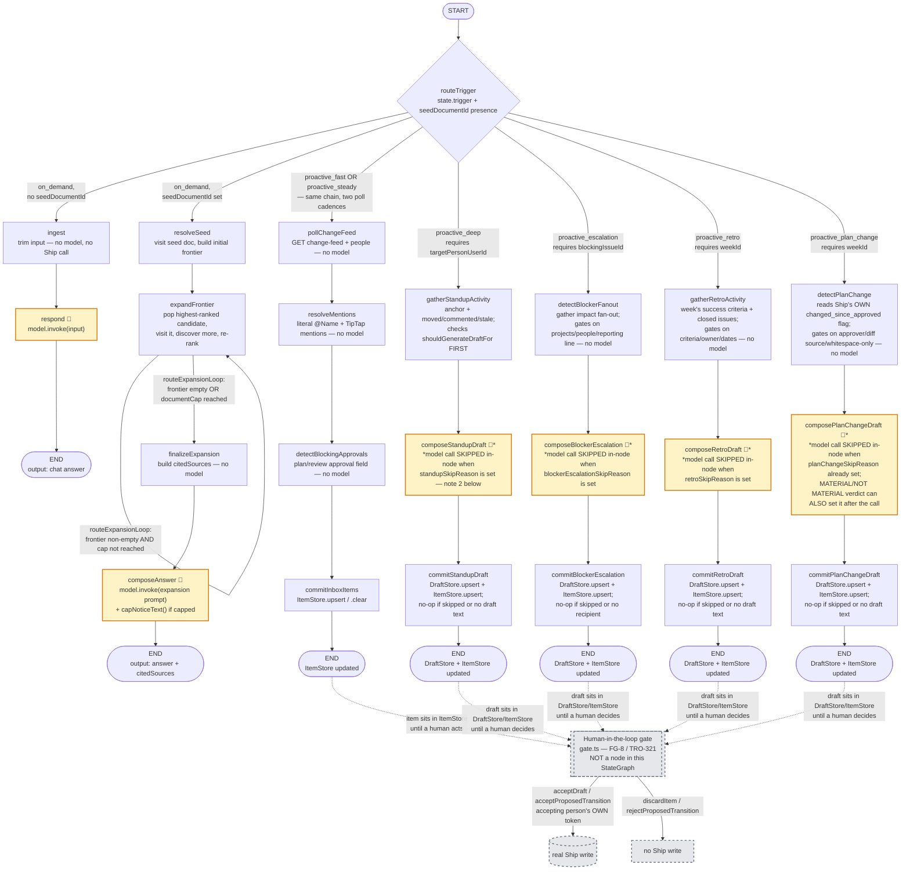

# FleetGraph

A project intelligence agent for Ship, the project management tool built by the U.S. Department
of the Treasury.

**Status:** Agent definition, graph architecture (FG-5/FG-6/FG-7/FG-8, `agent/src/graph.ts`),
execution traces, trigger model, deployment model, and the Architecture Decisions write-ups are
complete and written against the merged code (PRs #117, #120, #122) — every "settled" claim in
this document names the file that implements it. The Test Cases table's trace-link column remains
*Pending* (FG-22 / TRO-340): each row needs a run against its own fixture state, which is Early
Submission work. Anything still marked *Pending* is honestly pending, not a placeholder.

Last updated: August 5, 2026

---

## Agent Responsibility

### What the agent is for

Ship asks people to write down what happened — standups, weekly plans, weekly retros, weekly
reviews, project retros. Its accountability engine computes ten kinds of missing paperwork,
deterministically, and chases people for it.

That engine works. It also cannot tell whether any of the paperwork is true. The content check
strips three known template headings and passes if a single non-whitespace character remains, so a
weekly plan whose entire body is the word "stuff" is fully compliant.

The obvious response is to grade the writing. We tried that framing and rejected it. An agent that
tells a federal employee their standup looks thin — on a document that feeds a performance rating
— is a surveillance tool aimed at the least powerful person in the room. It also solves the wrong
problem. **People write "stuff" because writing it properly is tedious and they are busy.**
Enforcement does not change that. Removing the tedium does.

> **Ship asks people to write down what happened. FleetGraph already knows — so it writes the
> first draft, and it tells you what needs you.**

The agent saves time and surfaces obligations. It does not audit compliance.

### What it monitors proactively

Ship has no event bus. "Events" means observed state changes, found by comparing each document's
last-updated timestamp against a saved cursor and reading the document history table where entries
exist.

| Event | How it is observed | What the agent does with it |
|---|---|---|
| An issue changes state | A history row on the state field | Material for a standup draft |
| An issue changes assignee | A history row on the assignee field | Someone's list changes |
| A comment is posted | A new comment row | Draft material; possibly a mention |
| A document body is edited | The last-updated timestamp moves | Draft material |
| Someone is mentioned | Walking the changed body for mention markers | Goes into that person's list |
| A plan or review approval flips | The approval status field changes | Unblocks someone, or starts a clock |
| A week crosses a boundary | Date arithmetic on the week number | Opens the retro drafting window |

**Nothing in Ship writes a row when a week ends.** There is no change to detect, which is why a
purely change-driven design is insufficient and the agent needs a scheduled pass as well.

### What it reasons about on demand

The document you have open **seeds** the question. It does not fence it.

This corrects an earlier draft that treated the current view as a boundary and had the agent
refuse to look further. The brief says the chat "uses that as the **starting point** for its
reasoning." A starting point and a boundary are different things.

**The boundary is what you are allowed to see. The view only decides where to start.**

From the open document the agent walks outward as far as the question requires — the project, the
week, the program, the issues and their history, the people and their other work, documents that
mention it and documents it mentions, and what changed recently in any of those.

**It names every document it pulled in and why.** That is the trust mechanism: the reach of an
answer is always visible, so following the graph never feels like the agent went wandering.

### What it does without approval, and what always needs a human

The gate is **where the fact came from**, not how large the write is. The important part is what
the agent produces when it is not certain.

**It acts, when a query proves it** — each of these is a structured lookup with no interpretation:

- Resolving mentions to people to user accounts, and assembling those into someone's list
- Linking a document to the issue or week it refers to, when the reference is unambiguous
- Writing its own drafts and items, attributed to the agent
- Clearing its own item when the condition ends

**It drafts, when a model inferred it.** The second output mode is a draft the human edits and
posts. It never posts as the human, and never leaves an opinion the human is expected to act on.

**It never does these at all:**

- Writing a performance rating. These are federal performance ratings on the standard five-level
  scale. Not at any confidence, not for any reason.
- Setting an approval state, week status, or ownership.
- Applying an issue state transition. It may *propose* one with its evidence attached; a person
  accepts it.
- Creating, archiving, or deleting any document.
- Writing anything that would read as though a person wrote it.

> **Every output is either an action a query proved, or a draft a human confirms. The agent never
> has an opinion it expects you to act on.**

That rule is what structurally prevents the agent becoming a complaint generator.

Implemented in `agent/src/gate.ts` (TRO-321 / FG-8): every Ship write the gate can perform —
accept a draft, accept or reject a single proposed transition, discard — takes the acting person's
own token as an explicit parameter, and the gate's client type has no agent token to fall back to,
so a write under the agent's identity is impossible by construction rather than by convention.
Nothing upstream of the gate writes to Ship at all
(`agent/src/__tests__/graphWriteBoundary.test.ts` is the proof).

### Who it notifies, and when

Ship has no notification infrastructure at all — no notifications table, no email service, no push
mechanism. So the agent reaches people by writing into Ship itself.

The surface is **one list per person: what needs you.** Not a stream of individual pings.
Everything a person is on the hook for, assembled and ranked, presented when they arrive:

1. Mentions of them they have not seen
2. Approvals they are blocking — someone else's week cannot start
3. Work assigned to them that is waiting on something they control
4. Drafts the agent has prepared for them

Ranked by who else is blocked and for how long. Every item carries a direct action, not just a
description. Escalation to a manager exists but is last, and only after several periods with no
resolution — and because only half the people in the system have a manager recorded, that path
degrades gracefully when the link is absent. The agent never broadcasts to the workspace.

### Precision, and why the bar moved

A wrong draft costs a few seconds of editing, and the person was going to write the document
anyway. A wrong accusation, on a document feeding a performance review, costs trust permanently.

The earlier detection design optimised hard against the second and ended up doing almost nothing.
Changing the output format from criticism to draft removes most of that risk, which lets the
confidence bar come down, which lets the agent do considerably more. **The precision obsession was
downstream of a bad output format, not a fundamental constraint.**

The quality signal is also better than detection ever had: **how much of a draft survives to the
posted version.** A draft posted unedited was a good draft; one rewritten from scratch was not.
That is measurable in production with no labelling effort.

### How it knows who is on a project and what their role is

Ship keeps this in three places, and confusing them is the trap.

The workspace membership table has a role column, but it holds only "admin" or "member", and the
schema comment says in capitals that it is for authorization only. Using it to work out someone's
job is wrong.

Person documents hold the real data: a link to a user account, a link to a manager, and a free-text
job role. That job role is unreliable — free text with no fixed values, and in the current database
not one of the twenty people has it filled in.

Project membership lives in a separate associations table, alongside owner and assignee fields.

Roles are derived from structure, never read from a field:

| Role | How it is derived |
|---|---|
| Director | People reporting to them two or more levels deep; owns programs |
| Project manager | Owns projects or weeks; appears as approver on plans |
| Engineer | Has issues assigned; nobody reports to them |

---

## Graph Diagram

**Done (TRO-324 / FG-13, 2026-08-05).** Every node, edge and conditional below was read directly
off the compiled `StateGraph` in `agent/src/graph.ts` — its `.addNode`/`.addEdge`/
`.addConditionalEdges` calls, not the design brief. That source-level verification covers the whole
diagram, including the `proactive_deep` chain. Trace-level verification is narrower: only the bare
on-demand chat, on-demand expansion, and proactive fast/steady chains are additionally cross-checked
against the real LangSmith traces in the "Execution Traces" section immediately below, which show the
same node sequences actually executing for those three paths. The `proactive_deep` chain
(`gatherStandupActivity -> composeStandupDraft -> commitStandupDraft`) is verified against source
only, the same as the rest of the diagram — no real trace exists for it, because (per FG-21's own
finding, restated in this file's Cost Analysis section) `composeStandupDraft` still has zero real
invocations: no scheduler exists yet to trigger `proactive_deep` for a real person at all. Where the
diagram disagrees with the summary bullets that used to stand in this section's place, that
disagreement is called out explicitly rather than smoothed over — see the two notes after the
diagram.

**Updated (TRO-349, 2026-08-05).** Three chains were missing from the diagram above:
`proactive_escalation` (`detectBlockerFanout -> composeBlockerEscalation ->
commitBlockerEscalation`, TRO-346/TRO-337 / FG-19), `proactive_retro` (`gatherRetroActivity ->
composeRetroDraft -> commitRetroDraft`, TRO-335 / FG-17), and `proactive_plan_change`
(`detectPlanChange -> composePlanChangeDraft -> commitPlanChangeDraft`, TRO-336 / FG-18) — all three
already implemented in `graph.ts` (`buildGraph`'s `.addNode`/`.addEdge`/`.addConditionalEdges` calls
and the `routeTrigger`/`RouteKey` switch) but never added to this section. Added here the same way
as the rest of the diagram — read directly off that source, not the design brief. Same
source-only-verification posture as `proactive_deep`: `graph.ts`'s own module docstring states, for
each of the three, that "there is deliberately no scheduler in this file (or anywhere in this
package)" that decides when they run, so — same reasoning as `proactive_deep` above — no real
LangSmith trace exists for any of the three yet either.



**The four constraints, verified against the diagram above, node by node:**

- **Both modes run through the same graph; only the entry trigger differs.** True, and it is exactly
  `routeTrigger` above — one `addConditionalEdges(START, routeTrigger, {...})` call in `graph.ts`,
  reading `state.trigger` (and, for `on_demand`, whether `seedDocumentId` is set) to pick one of five
  route keys. Confirmed against `routeTrigger`'s own source (`graph.ts:617-628`), not inferred.
- **The on-demand path expands outward with a hard cap, and that loop is the main source of
  genuinely different execution paths between runs.** True, and it is `expandFrontier`'s real
  self-edge (`addConditionalEdges('expandFrontier', routeExpansionLoop, {...})`,
  `graph.ts:922-925`) — a document-rich seed loops many times before the cap or an empty frontier
  exits it; a sparse one exits after one or two hops. The "Execution Traces" section below shows this
  concretely: a real run against a seed with project/sprint/program/assignee associations produced 47
  child spans (many `expandFrontier` visits, cap reached at 12 documents) against 9 for the bare
  on-demand chat path with no seed.
- **One human-in-the-loop gate.** True, but it is not a node in this `StateGraph` at all — `gate.ts`
  (FG-8 / TRO-321) is a separate module, called later, under the ACCEPTING PERSON'S OWN token, once
  they open a drafted item and decide. Nothing in `graph.ts` ever writes to Ship (`DeepShipClientLike`
  and `OnDemandShipClientLike` are read-only interfaces by construction — see `graph.ts`'s own module
  docstring); `DraftStore`/`ItemStore` are both entirely in-process. The diagram shows this as an
  external, dashed box specifically so it is not mistaken for part of the graph's own topology. Note
  that the two `on_demand` paths (`ENDchat`/`ENDanswer`) do NOT route through this gate at all —
  `respond`/`composeAnswer` return their output directly as the synchronous `/chat` response; there is
  no stored draft to later accept or discard for a chat answer, only for standup drafts and proposed
  transitions (the `proactive_deep` path) and inbox items (`proactive_fast`/`proactive_steady`).
- **The proactive path composes drafts once per person per window, not once per change.** True as a
  DESIGN COMMITMENT, but — see Note 1 below — this is **not currently a branch in the compiled
  graph** the way the other three constraints are. Read on.

**Note 1 — "is a window open" is not a graph branch today; it is an unbuilt external
scheduler's job.** The old text in this section (now replaced) said the graph "branches on 'is a
window open for this person'." Read against `graph.ts` directly, that branch does not exist anywhere
in the compiled graph: there is no node or conditional edge anywhere in `buildGraph` that asks
"has this person's standup window opened yet." The `proactive_deep` trigger requires a
`targetPersonUserId` to already be known and passed in (`requireTargetPersonUserId`,
`graph.ts:586-595`) — WHO gets a draft composed, and WHEN, is entirely the responsibility of a
caller this graph does not contain. The module's own docstring says so directly:
*"There is deliberately no scheduler in this file (or anywhere in this package) that decides WHOSE
window is open and invokes the graph for them."* The thing that DOES live inside the graph and is
easy to mistake for the same idea is `shouldGenerateDraftFor` (checked first thing inside
`gatherStandupActivity`, `graph.ts:830`) — but that is a different question: "has this person been
ignoring their last several drafts long enough that composing another one is waste" (cost cliff #3),
evaluated only AFTER the graph has already been invoked for them. It is not "is it currently their
window." Both are real, correct design commitments; only one of them is implemented as graph
structure as of this ticket. This is exactly the kind of prose/code gap this repo's provenance rules
exist to catch — recorded here rather than quietly reworded away.

**Note 2 — the deep-tier "skip if ignored" behavior is an in-node data branch, not a StateGraph
conditional edge.** Contrast this directly with `expandFrontier`'s self-loop, which IS a real
`addConditionalEdges` call. `gatherStandupActivity -> composeStandupDraft -> commitStandupDraft` is
three plain `.addEdge` calls (`graph.ts:928-929`) — `composeStandupDraft` always runs as a graph
node, every single time, regardless of `standupSkipReason`. The skip is a plain `if
(state.standupSkipReason) { return {}; }` inside that node's own function body
(`graph.ts:844-848`), never calling `model.invoke` on that path. A LangSmith trace of a skipped run
would show `composeStandupDraft` as a real, present, near-instant span with no model child run
underneath it — structurally different from `expandFrontier`'s self-loop, where the NUMBER of
`expandFrontier` spans in a trace varies run to run. The diagram marks this with a footnoted 🤖\* on
the node rather than drawing a second decision diamond that does not correspond to a real edge in
the code.

---

## Execution Traces

**Done (TRO-324 / FG-13, 2026-08-05).** Three real LangSmith traces, produced in this worktree
against the real Anthropic API (for the two on-demand traces) and the real local Ship API (all
three), captured via the LangSmith API (`GET /runs/{id}` and `POST /runs/query`) the same way FG-21
verified its own trace — never eyeballed from the console. All three sit in the same
`fleetgraph-agent` LangSmith project (`c1e38b67-b458-4e8b-a680-be74ece5e1a6`) FG-21 already used, so
they are directly comparable. Every trace link in this section is a public LangSmith share link —
no login or org membership required to open it.

| Path | Trigger | Trace | Child spans | Real cost |
|---|---|---|---|---|
| Bare on-demand chat (`ingest -> respond`, FG-2) | `on_demand`, no seed | [45c12238](https://smith.langchain.com/public/53ee51bf-7f86-4ed5-bef2-3b0ecf9d596e/r/45c12238-df88-4c11-bd67-1ee27edc0736) | 9 | $0.000218 (FG-21's own trace, reused here — not re-run) |
| On-demand expansion (`resolveSeed -> expandFrontier` ×9 `-> finalizeExpansion -> composeAnswer`, FG-7) | `on_demand`, real seed document (`96ed3528-…`, an issue with project/sprint/program associations) | [5e9d072b](https://smith.langchain.com/public/592b4f32-3c11-43ed-9abc-640c3f8257ee/r/5e9d072b-0559-41ff-bbba-3fa4df218142) | 47 | $0.00101 |
| Proactive deterministic (`pollChangeFeed -> resolveMentions -> detectBlockingApprovals -> commitInboxItems`, FG-5) | `proactive_steady`, real change-feed cursor | [88b0880a](https://smith.langchain.com/public/8e698e3a-d0a4-47ba-97ee-de0098c5660d/r/88b0880a-f4dd-4ac6-b496-1ae66235377a) | 14 | $0 (no model call anywhere on this path — verified: LangSmith itself reports `total_tokens: 0` for this run) |

**What genuinely differs between these three, verified via `GET /runs/{id}`'s own
`child_run_ids`/`inputs`/`total_tokens` fields, not asserted:**

- **Node names.** The proactive trace's `POST /runs/query?trace=<id>` child list is exactly
  `pollChangeFeed -> resolveMentions -> detectBlockingApprovals -> commitInboxItems` (plus LangGraph's
  own internal `ChannelWrite`/`Branch` bookkeeping spans) — no `respond`, `composeAnswer`, or
  `composeStandupDraft` node anywhere in it, confirming "no model" for this tier is true at the trace
  level, not just in the source comment.
- **Span count as a direct, observable proxy for the expansion loop's real variability.** 9 spans
  (bare chat) vs. 47 spans (expansion, `documentCap=12` reached) vs. 14 spans (proactive, fixed
  4-node chain) — three different real numbers for three genuinely different graph shapes, not one
  execution path relabeled three ways.
- **`inputs.seedDocumentId`/`inputs.trigger`, read back from LangSmith itself.** The expansion
  trace's own recorded input shows `seedDocumentId: "96ed3528-c565-4c53-ad67-e157ecc60a8a"` and
  `trigger: "on_demand"`; the proactive trace's shows `trigger: "proactive_steady"`,
  `cursor: "2026-08-05T01:14:00.840Z"` — the actual arguments each run was invoked with, not
  reconstructed after the fact.

**How they were produced.** `pnpm --filter @ship/agent trace:invoke-on-demand -- 96ed3528-c565-4c53-ad67-e157ecc60a8a "What is going on with this issue, and what week and project is it part of?"`
against this worktree's own local `pnpm --filter @ship/api dev` (port 3884, this worktree's own
seeded database `ship_wt_tro_331` — never the graded Render deployment) produced the expansion
trace. The proactive trace needed a new script — no equivalent to `trace-invoke.ts`/
`trace-invoke-on-demand.ts` existed for FG-5's deterministic path before this ticket — so this ticket
adds `agent/src/scripts/trace-invoke-proactive.ts` (`pnpm --filter @ship/agent trace:invoke-proactive`),
covered in full in the Cost Analysis section's detection-latency writeup below, since the same run
that produced this trace also produced this ticket's real detection-latency measurement.

**One real cost incurred by a genuine mistake, disclosed rather than hidden.** While first invoking
`trace-invoke-on-demand.ts` directly via `pnpm exec tsx ... -- <args>` (bypassing the package.json
script alias), a literal `"--"` was passed through as the script's own `seedDocumentId` argument
instead of being consumed as a separator — `pnpm --filter @ship/agent trace:invoke-on-demand -- <args>`
(via the package script) strips it; `pnpm exec tsx <script> -- <args>` (invoked directly) does not.
The result was one real, unintended `on_demand_expand` invocation against an invalid seed id — real
tokens spent (94 in / 120 out, $0.000694), real trace produced
([9b24aa47](https://smith.langchain.com/public/ee2db601-70a1-474b-bbe2-603395438bfa/r/9b24aa47-4260-4e0d-9b99-639b1806fc11), `documentsPulled: 0`,
`resolveSeed` failed to fetch the malformed id and correctly produced a "no accessible document"
answer rather than fabricating one). Not used as either of the two required comparison traces above
— reported here because it is real spend a reader of the cost ledger will otherwise not be able to
account for, and because pretending it did not happen is exactly the kind of smoothing-over this
repo's provenance rules exist to prevent.

---

## Use Cases

Every one either saves time or removes a lookup. None grade anybody.

| # | Role | Trigger | Agent detects / produces | Human decides |
|---|---|---|---|---|
| 1 | Engineer | The standup window opens on a working day for someone with assigned issues in an active week | A draft standup assembled from what actually happened — issues that changed state, comments written, documents edited, blockers hit. Where nothing moved, it says so and names what has been sitting | Edit and post, or discard. Accept or reject any proposed issue state changes individually |
| 2 | Anyone | The person opens Ship, or opens the panel | One ranked list: mentions they have not seen, approvals they are blocking, work waiting on them, drafts prepared for them — each with why it matters and a direct action | What to act on, and in what order |
| 3 | Engineer or PM | The retro window opens for a week whose plan carries at least one success criterion | The delivered section pre-filled from issues that actually closed, mapped against each criterion, with unmatched criteria called out so they can be explained rather than quietly dropped | Edit, add unplanned work the agent cannot see, submit |
| 4 | Director | A weekly plan is edited after it was approved | What materially changed, before and after side by side, plus a drafted re-approval request or a drafted question to the author | Re-approve, or send the question |
| 5 | Director or PM | An issue blocks work in two or more projects whose blocked people sit in different reporting lines | The full impact, the lowest manager with authority over everyone blocked, and a drafted message to them | Send it, or step in directly |
| 6 | Anyone | The person opens the chat panel anywhere in Ship | An answer seeded by the open document and expanded along whatever the question requires, naming every document pulled in and why | What to do about it |

**Notes**

**Use case 1 absorbs what used to be a separate "your standup is thin" detection.** The drift
signal still gets delivered — it is just delivered as help. Removing that detection as a
standalone use case was a deliberate decision: it was the only case where the agent criticised a
person directly, on a document feeding a performance rating, and it is the notification users mute
first.

**Use case 2 replaces per-mention notifications.** An earlier design pinged on each mention event.
That is dribble. What a person wants on arrival is everything that needs them, in one place,
ranked — an inbox, not a stream.

**Use cases 1 and 2 need no language model for their hardest parts.** Mention resolution and
approval-blocking are structured lookups. The model composes prose and ranks; the floor underneath
it is deterministic.

**Use case 5's Ship-side dependency has shipped; its agent side has not.** When this was first
written, Ship could not express "issue A blocks issue B" at all. It now can: migration
`041_add_blocks_relationship.sql` (FG-15 / TRO-333) added `blocks` to `relationship_type`,
migration 040 rejects circular association chains, and PR #120 added the blocks/blocked-by sidebar
(TRO-334). What remains is the agent's half of the use case — the impact fan-out,
lowest-common-manager resolution, and drafted message — which no graph node implements yet.

---

## Trigger Model

### The decision: hybrid, with polling as the backbone

| Tier | How often | What it does | Latency |
|---|---|---|---|
| **Fast** | The moment a document is saved | Mentions and assignment changes land in the affected person's list. No model. | ~3 seconds |
| **Steady** | Every 60 seconds | Collect what changed; hold the material each person's next draft will be built from | ~80 seconds |
| **Deep** | Per person, before their window opens | Compose the drafts — standups in the morning, retros at week end | Scheduled |

The steady tier used to be where the model ran, once per suspicious change. Under drafting it
mostly **accumulates material**, and the model runs once per person per window instead. That is
cheaper per unit of value and produces better output — a standup written from a whole day of
activity beats six separate observations.

The five-minute detection requirement binds only on the fast tier, which is deterministic and runs
in about three seconds.

**Implementation status (2026-08-04):** the steady tier is live — `agent/src/index.ts` starts the
poll loop at `DEFAULT_PROACTIVE_POLL_INTERVAL_MS = 60_000` (`config.ts`), and each tick runs the
deterministic `pollChangeFeed → resolveMentions → detectBlockingApprovals → commitInboxItems`
chain, which is the traced proactive run in the Execution Traces section. The graph also accepts
`proactive_fast` through the same chain, but the Ship-side in-process save hook that would trigger
it is not built yet — today "fast" is simply this poll at whatever cadence it is configured to. The
deep tier's composition path (`proactive_deep`) is implemented and tested end-to-end, but nothing
yet schedules it per person — `index.ts`'s own module comment states there is no scheduler in the
package that decides whose standup window is open.

Polling works as the backbone because Ship's collaborative editor saves on a two-second delay and
always stamps the last-updated time when it does, making that timestamp a complete signal for
every content change. The document history table is only partial by comparison — it records field
changes broadly but body text only for weekly plans and retros.

### The tradeoffs

| | Polling only | Webhooks only | Hybrid (chosen) |
|---|---|---|---|
| Changes needed in Ship | One read endpoint | Emission code in 2+ places | One read endpoint plus one in-process hook |
| Coverage | Complete | Only where emission was added | Complete |
| Missed events | Self-correcting — next tick re-reads | Permanent. A dropped delivery is gone | Polling backstops the fast path |
| Week boundaries | Detected — the schedule is the trigger | Never fires. Nothing changes when a week ends | Detected |
| Mention reaching a list | Up to 60 seconds | ~1 second | ~3 seconds |
| Cost when idle | One indexed query returning nothing | Nothing | One indexed query returning nothing |
| Coupling to Ship's uptime | None | Ship's save path waits on your endpoint | None — the hook is fire-and-forget |
| Testability | Replay a time range | Must simulate emission | Both |

**Webhooks alone fail for two verified reasons.** Ship has no outbound webhook mechanism and no
database notification channel, so emission would need adding both to the REST write path and to the
collaborative editor's save path — and missing the second blinds the agent to the document edits
its drafts are built from. And a week ending produces no change at all, so there is nothing to
hook.

**Polling alone is genuinely viable** and was the runner-up, costing up to 60 seconds before a
mention reaches someone's list. The hybrid buys that back for the price of one hook, and if the
hook fails the poll still catches it within a minute. **The fast path is an optimisation on top of
a correct baseline, not something the design depends on.**

### Reliability

**The cursor must lag.** Asking for everything updated since a saved timestamp permanently misses
rows whose transaction commits after the cursor moved past their timestamp. An auto-incrementing
history ID has the same flaw — those numbers are handed out before commit. The fix is to lag the
cursor behind real time and de-duplicate. **Implemented, on both sides:** the endpoint holds back
rows newer than a safe cutoff (`CHANGE_FEED_LAG_MS = 5_000` in `change-feed.ts`), and the agent's
poll loop (`agent/src/proactivePoll.ts`) advances its cursor only after a successful tick, so a
failed poll re-reads the same window instead of skipping past it.

**Both of Ship's rate limiters fail open.** On a cache outage the server-side ceiling disappears
entirely, so the agent cannot treat it as a safety net and must throttle itself.

### The blocking dependency (resolved — the change-feed shipped)

**When this was written, Ship's API had no way to ask what changed.** No "since this time"
parameter existed anywhere; the main document listing endpoint sorts by position and creation
date, so recently-updated documents never surfaced; paging is offset-only. An agent deployed
separately could not go around it — the production database sits in private subnets reachable
only from the application's own servers.

The decision was to **add a change-feed endpoint to Ship** rather than move the agent inside the
network, because keeping permission enforcement inside Ship's own API matters in a system carrying
federal performance ratings. That endpoint now exists: `GET /api/change-feed`
(`api/src/routes/change-feed.ts`, FG-1 / TRO-312, mounted in `app.ts`), backed by the
last-updated index that came directly out of the Week 4 audit. It is the poll source the traced
proactive run above actually used — the graph's `pollChangeFeed` node is a thin wrapper around it.

---

## Test Cases

**The graph these cases exercise is built and merged** — PR #117 (proactive detection, on-demand
expansion, standup drafts, the gate) and PR #120 (the UI surfaces) — and three of its four paths
have already been traced against real data in the Execution Traces section above. The `Trace Link`
column below stays `Pending` for a narrower reason than when this section was first written: each
row needs a run against its own specific fixture state, and those fixtures are only partially
constructed (see the graded-database status directly below). Filling the column is Early
Submission work.

**Graded-database fixture status — all four resolved (TRO-357, 2026-08-06).** The gap below was
closed by re-running the (by then repaired) seed against the graded database — history kept, not
rewritten:

**Original run (TRO-341/FG-23, 2026-08-04) — seeded, with two real gaps found, not hidden.**
`pnpm db:seed` ran against the graded `ship-db` (external connection, temporary IP allowlist, reset
immediately after). Pre-seed sanity check: 257 documents / 11 users / 0 `document_history` rows,
matching the documented 2026-07-28 snapshot exactly — confirming this database's existing rows
really were produced by this same seed script, the precondition the seeding plan itself named.
Post-seed: Test Cases 2 and 4 fixtures created successfully; Test Case 3's fixture ran but produced
0 closed issues, not the 3 its own row requires; Test Case 1's fixture did not fire at all. Both
gaps traced to the same root cause — the old fixture logic *selected* pre-existing issues from
whatever sprint resolved as "current" *today*, and issue-to-sprint assignments (frozen at the
2026-07-28 base-data creation) had drifted out of alignment with it six days later. Recorded, not
fixed in that pass: its scope was seeding and environment, not redesigning the fixture's
sprint-selection logic.

**Fix (TRO-345, PR #130, merged to `main` 2026-08-05).** `api/src/db/seed.ts` reworked so Test
Cases 1 and 3 **create** their own Ship Core issues directly in the current sprint, each behind its
own idempotency marker (`properties->>'fg3_fixture' = 'tc1'`/`'tc3'`) independent of the block-wide
`document_history`-non-empty gate — so a repaired seed run can create these rows against a database
where Test Cases 2/4 (and that gate) had already fired, without disturbing them. Code only; the
re-seed itself (item 2 of that ticket's scope) was deliberately held for sign-off.

**Re-seed (TRO-357, 2026-08-06) — gap closed, both fixtures now fire.** Temporary IP allowlist
opened to a single `/32`, pre-seed check (375 documents / 11 users / 1 workspace /
1 `document_history` row — grown from the 2026-08-04 snapshot by organic activity against the live
graded deployment in the intervening 9 days, not a wrong-database signal: the workspace/user counts
and every known TC2/TC4 document id below matched exactly before proceeding), `pnpm db:migrate`
(no-op, already current), `pnpm db:seed` (additive — printed `✅ Test Case 1 fixture` and
`✅ Test Case 3 fixture` by name, then the `📋 FG-3 test case document ids` block below), allowlist
reset to `[]` and reset confirmed via a follow-up `GET`. Post-seed: documents 375 → 382 (+7: TC1's
3 issues + 1 standup, TC3's 3 issues), `document_history` 1 → 2 (TC1's one state-change row),
`fg3_fixture='tc1'`/`'tc3'` issue counts 0 → 3 / 0 → 3. Directly queried and confirmed: engineer
Emma Johnson now has exactly 3 non-done TC1 issues (`in_review`, `in_progress`, `todo`, the last
untouched for 7 days); the TC3 week carries all 4 success criteria with exactly 3 `done` issues
completed inside the current week window. TC2/TC4's ids (table below) still resolve to the same
document type and title as the 2026-08-04 run — unchanged.

Document ids that resolve, against the graded `ship-db` (not this worktree's local scratch
database):

| Fixture | Document id |
|---|---|
| Test Case 1 — standup anchor | `85676a52-d676-429c-8d76-9c74b1bbdb8a` |
| Test Case 1 — moved to in_review | `cfc40bfe-4a77-48e3-938a-46412695f331` |
| Test Case 1 — commented | `6e0ad162-7255-42ab-bd89-8250304913bf` |
| Test Case 1 — stale (7 days untouched) | `e252bd46-b1e8-4f14-9bb5-2aa174e3f3df` |
| Test Case 2 — mention 1 | `65f499b2-8e8c-417c-8372-f60ff4ba8c75` |
| Test Case 2 — mention 2 | `a8a08536-d4ef-44a9-a9c1-12d1efe39dc4` |
| Test Case 2 — blocked week | `e5adadd7-e574-4f6b-9893-3da2261cf463` |
| Test Case 3 — week (3 issues closed within it, 4 success criteria) | `c8dfb32e-5b08-47d4-8150-af7728543ac4` |
| Test Case 3 — closed issues | `71eb8b0e-bcdb-4463-9e78-ce1a88cf2361`, `5f593b41-8668-4077-90cd-d4b99b4df79d`, `343d850f-dc9c-4c83-8f15-7f752cb9813d` |
| Test Case 4 — week (approved then edited) | `0e44bc95-6ee9-4aa7-a6c0-41205bf87e85` |

These are document ids the fixture states live at, not LangSmith trace links — the `Trace Link`
column below stays `Pending` until PR-C's graph actually runs against them.

| # | Ship State | Expected Output | Trace Link |
|---|---|---|---|
| 1 | An engineer with 3 assigned issues; since their last standup, one moved to in review, they commented on another, and the third has not moved in 6 days | A draft standup naming the two that moved and what changed, flagging the third as sitting for 6 days, with a proposed state change on the one in review | Pending |
| 2 | A person mentioned in two documents they do not own, blocking one approval on someone else's week, with a standup draft waiting | A four-item ranked list, approval first because another person's week cannot start, each item carrying a direct action | Pending |
| 3 | A week whose plan lists 4 success criteria; 3 issues closed during the week, mapping to 2 of them | A delivered section pre-filled from the 3 closed issues, mapped to their criteria, with the 2 unmatched criteria called out | Pending |
| 4 | A weekly plan approved at version N, then edited to remove one success criterion | A before-and-after on the removed criterion plus a drafted question to the author, routed to the approver | Pending |
| 5 | An issue in Project A blocking two issues in Project B whose assignees report to different managers | The impact fan-out, the lowest common manager, and a drafted message | Pending — the `blocks` relationship itself shipped (migration 041, FG-15 / TRO-333, plus PR #120's blocks/blocked-by sidebar); the agent-side fan-out walk does not exist yet |
| 6 | A user opens the chat on an issue and asks why it is stalled; the answer requires its week, its blocking issue, and a comment on a different document | An answer drawing on all four documents, each named with the reason it was pulled in | Pending |

**Most of these have no reachable trigger state today.** The development database is a load-testing
fixture built to a Week 4 specification, and it records none of the activity these drafts are built
from: the document history table is empty, comments are empty, issue start and completion
timestamps are unset on all 254 issues including all 71 marked done, and plan approval state is
unset on all 35 weeks. The code that writes all of this exists and runs in normal use, so this is
fixture work rather than a research problem — and the brief explicitly asks for "the Ship state
that should trigger the agent," which makes constructing them part of the assignment.

---

## Architecture Decisions

### Framework

**Settled — LangGraph.** `@langchain/langgraph` is a real dependency of `agent/package.json`, and
the whole agent is one `StateGraph` over a typed `Annotation.Root` state in `agent/src/graph.ts`.
The traces in the Execution Traces section landed in LangSmith through LangGraph's native
instrumentation — no manual instrumentation was needed, which is exactly why the brief
recommended it.

### Node design rationale

**Settled — implemented in `agent/src/graph.ts`.** One compiled graph serves every mode.
`routeTrigger` branches from START on the trigger (plus `seedDocumentId` presence) into four
paths: bare chat (`ingest → respond`); seeded expansion (`resolveSeed → expandFrontier`, a
conditional self-loop that runs until the frontier empties or `documentCap` is hit, then
`finalizeExpansion → composeAnswer`); the deterministic proactive chain
(`pollChangeFeed → resolveMentions → detectBlockingApprovals → commitInboxItems`, no model call on
the whole path); and the deep tier (`gatherStandupActivity → composeStandupDraft →
commitStandupDraft`). Both principles this section fixed in advance survived implementation:
accumulation and composition run on different clocks (the proactive chain commits material to the
item store; the deep tier composes per person), and the expansion loop is the main source of
run-to-run path difference — observed directly as 9 vs 47 vs 14 child spans across the three
traces above.

### State management

**Mostly settled — one of the three planned requirements is deliberately not built yet.** Within a
run, all state lives in the graph's typed channels (`GraphState` in `graph.ts`); the expansion
loop's `visitedDocumentIds` channel is what stops it re-reading a document it already pulled.
Between proactive runs the carried state is exactly the lagged change-feed cursor, held in memory
by `proactivePoll.ts` and advanced only on success. Per-person accumulated material lives in
in-memory stores (`itemStore.ts`, `draftStore.ts`) by explicit, documented decision — see
`itemStore.ts`'s header: one agent process, and every item is re-derivable from Ship's own state
on the next poll, so a restart costs at most one 60-second cycle, not lost data. The third planned
piece — a cross-request cache keyed on document + content version, so ten people asking about the
same week do not each re-read it — is **not implemented**; every run re-fetches what it needs. The
cache-key reasoning stands for whenever load makes it worth building.

### Deployment model

**Settled (TRO-341 / FG-23).** Topology: **Ship-on-Render (`https://ship-rr6m.onrender.com`) +
agent-on-Render (`https://ship-agent-t0zy.onrender.com`, current URL — see the redeploy note below,
it changes on every clean-machine `apply`) + the Render Postgres `ship-db`
(`dpg-d9kgth6417fc7386hhh0-a`) as the graded database.** This is the ticket's own recommended
default, adopted without deviation: no AWS credentials have existed in this environment all sprint
(re-verified this ticket: no `aws` CLI, no `AWS_*` env vars), so the AWS stack was never a live
option to weigh against it.

**Authentication does not expire.** Ship's session timeouts — fifteen minutes idle, twelve hours
absolute — apply only to browser sessions. API tokens are handled first and bypass that logic;
they are bounded only by their own expiry, which can be unset, and by explicit revocation. A
headless agent needs no re-authentication schedule.

**There is no service account.** Every API token belongs to a real user, so the agent runs under
each person's own token. This matters more under the current design than it did before — following
the graph outward from the open document means reaching documents the person did not open, and
running as them is what makes that safe by construction. **It can reach anything you could reach,
and nothing you could not.**

**Private documents are currently hypothetical.** All 523 documents are workspace-visible and none
are private. The risk is real in the schema and absent from the data. That count is the local
development database's; the graded `ship-db` is a **separate, smaller** dataset — 257 documents as
of its last verified snapshot (`memory-bank/techContext.md`, 2026-07-28) — and does not
automatically track a local worktree's seed. Closing that gap for the Test Case fixtures
specifically is this ticket's seeding-plan section below.

**Network path.** Production traffic must go through the content delivery network; the load
balancer accepts nothing else.

**Terraform, `/health` + `/ready`: done, including `apply` (TRO-313, TRO-315, TRO-316).** `agent/`
is a Render docker web service (`terraform/render/agent_service.tf`), deployed in the same Render
root as `ship` itself — target platform is Render, not AWS, per the standing no-AWS-credentials
fact above. `terraform apply` and a full destroy-and-redeploy proof both ran on 2026-08-04 with
explicit human sign-off, scoped only to the new agent service
(`terraform/render/plan/tro-316-destroy-redeploy-proof.md`): create → verified `/health`/`/ready`
200 → targeted `destroy` of the agent alone (verified `ship`/`ship-db` untouched) → re-`apply` from
config alone, no import → verified `/health`/`/ready` 200 again on the newly generated URL. **One
piece that proof deliberately left open, now closed:** `SHIP_API_TOKEN` was applied as a placeholder
string; a real per-user token has since been minted (see "Login and the 403" below) and wired into
the live agent — see the "Done, 2026-08-04" paragraph under "Login and the 403" for exactly how
(not via a second `terraform apply`, which hit a provider bug — worked around via the Render REST
API directly).

**Confirmed (not assumed): which branch Render deploys, and whether merged code actually reaches
it.** `git_branch` defaults to `"main"` in `variables.tf` for both services, and the live
`terraform.tfstate` (main checkout, refreshed 2026-08-04) matches: both `render_web_service.ship`
and `render_web_service.agent` show `runtime_source.docker.branch = "main"`,
`auto_deploy = true`. Cross-checked directly against the Render API
(`GET /v1/services/srv-d9kf2t942hec73aofrt0`): `autoDeploy: yes`, `branch: main` — config is
correct. **But the live `ship` service has not actually redeployed since 2026-07-30**, observed
three independent ways: (1) `GET /v1/services/.../deploys` and `.../events` list the last
`deploy_ended`/`succeeded` at `2026-07-30T22:00:22Z`, commit `09a6895a` ("...ALB SG locked to
CloudFront..."), triggered by an API call (this repo's own TF-10 verification session) — zero
deploy events of any kind since, despite `main` receiving PR-A (`2f198f6`, 2026-08-03 20:07 EDT)
and PR-B (`0db1fd0`, 2026-08-03 21:54 EDT) in the interim; (2) `GET /` on the live service returns
`last-modified: Thu, 30 Jul 2026 21:59:21 GMT` on its static asset, consistent with the same stale
build; (3) `GET /api/change-feed` (a PR-A route, `api/src/app.ts:401`) returns a bare `404 Cannot
GET`, not an auth error — the route itself is absent from what's running. **So PR-A's change feed
and `blocks` endpoints, and PR-D's UI surfaces, are not yet live on the graded Ship**, despite both
being on `main` and despite `auto_deploy` being correctly configured — auto-deploy is not firing.
Root cause not fully diagnosed: `gh api repos/troysatchell/ship/hooks` returns `[]` (no classic
webhooks), which is suggestive but not conclusive, since Render's GitHub integration commonly runs
through a GitHub App installation rather than a classic repo webhook, and this session's `gh` token
cannot list App installations to check that directly.

**Done, 2026-08-04, with explicit human sign-off.** The remediation call below was run by the
orchestrator against `srv-d9kf2t942hec73aofrt0`. Result: deploy `dep-d9ouj9jl550s73feh900` reached
`live`, commit `ef9d9c7` (current `main` at the time). Verified after, not just trusted: `GET
/api/change-feed` unauthenticated now returns `401` (auth required — the route exists) instead of
the prior bare `404`, and `GET /`'s `last-modified` header moved from `2026-07-30` to
`2026-08-04T13:31:47Z`. **PR-A's routes are now live on the graded Ship.** Root cause of why
`auto_deploy` itself never fired is still not diagnosed — this was a manual workaround, not a fix to
the underlying trigger, so the same gap will recur on the next push unless someone with Render
dashboard access checks the GitHub App installation.

**Standing operational procedure until that root cause is fixed:** after merging anything to `main`
that the graded demo depends on (PR-D, PR-E, PR-F, PR-G), do not assume `auto_deploy` fired.
Manually verify — `GET https://ship-rr6m.onrender.com/` and check its `last-modified` header against
the merge time, or probe a route the merge actually added (the same pattern used above,
`/api/change-feed`). If it's stale, trigger the same remediation call this ticket used:
```bash
curl -X POST https://api.render.com/v1/services/srv-d9kf2t942hec73aofrt0/deploys \
  -H "Authorization: Bearer $RENDER_API_KEY" -H "Content-Type: application/json" -d '{}'
```
The identical procedure applies to the agent service (`srv-d9otunmgekts73eqs0h0` as of this ticket
— re-check the current id via `terraform output agent_service_url`/state, since it changes on every
clean-machine `apply`) whenever `agent/` code changes land on `main`.
```bash
curl -X POST https://api.render.com/v1/services/srv-d9otunmgekts73eqs0h0/deploys \
  -H "Authorization: Bearer $RENDER_API_KEY" -H "Content-Type: application/json" -d '{}'
```
(An earlier revision of this section repeated the *ship* service id in the agent command above — a
copy-paste error, corrected 2026-08-05.)

**The gap recurred exactly as predicted, 2026-08-05 (pre-MVP-submission check).** Verified stale,
observed directly, not inferred: `GET /` on the graded Ship still returned
`last-modified: 2026-08-04T13:31:47Z` (the previous manual redeploy), `GET /api/agent/inbox`
(a PR-D route) returned a bare `404`, and the agent service's own `/chat` and `/inbox` (also PR-D)
returned `404` while `/health`/`/ready` returned `200` — both services were running pre-PR-C/PR-D
builds. Auto-deploy had again not fired for any of the four merges since (#117, #120, #122, #123).
Remediation: the standing procedure above, run against both services — deploys
`dep-d9pajpnavr4c73b7l300` (ship) and `dep-d9pajpm7bikc73ap8c30` (agent), both building
`main`@`d124a50`, triggered `2026-08-05T03:11Z`.

**Post-deploy verification (2026-08-05T03:12–03:35Z), all observed, and it caught a second gap.**
`GET /`'s `last-modified` moved to `2026-08-05T03:12:15Z`, and `GET /api/agent/inbox`
unauthenticated flipped from bare `404` to `401` (route live, session-gated). But the agent's own
`/chat` and `/inbox` then returned `500 internal_secret_not_configured` — the server's own
explicit branch, not a crash. Cause: PR-D introduced `AGENT_INTERNAL_SECRET`, but Terraform cannot
update the free-tier agent service (the render-oss/render provider bug above), and
`terraform/render/*.tf` never gained the new variables at all (checked: zero references) — so the
secret existed nowhere: not on the agent, and not on the ship service either, which was also
missing `AGENT_API_BASE_URL` (the code default, `http://localhost:3100`, is meaningless on
Render). Getting these into Terraform config is real follow-up work, tracked as `TRO-347`.
Remediated via the Render REST API — the documented workaround for this exact provider bug: one
minted secret set on both services, `AGENT_API_BASE_URL=https://ship-agent-t0zy.onrender.com` on
ship, then one more deploy each (`dep-d9pal98ae00c73ek3t0g`, `dep-d9pal9lbedkc73bl7pf0`).
Verified end-to-end as a grader would hit it, not just at the health check: agent `/chat`/`/inbox`
without the secret now return `401` (was `500`); with it, `400` invalid-body — which proves the
request passed both the secret gate *and* the graph-configured gate. Then a real browser-style
session (CSRF token → login as the seeded dev user → `POST /api/agent/chat` against Test Case 2's
fixture document `65f499b2-…`) returned a grounded answer naming the document, its week, and its
project, with `citedSources` and the expansion-cap notice — the full
session → api-proxy → internal-secret → graph → model chain, live on the graded deployment. The
secret itself lives only in Render env config and the operator's local machine, not in the repo.
This triggers a deploy of the service's configured branch (`main`) HEAD — equivalent to what
`auto_deploy` should already be doing on every push. Confirm after with `GET .../deploys?limit=1`
(expect `status: "live"`, a `createdAt` after this call, `commit.id` matching current `main`) and
`GET /api/change-feed` (expect no longer a bare 404 once the new code is live and reachable with
auth).

**Rollback trigger and procedure.** Two layers, neither of which is a bespoke script:
1. **CI gates merge, not just deploy.** `.github/workflows/ci.yml`'s own header states it is "the
   merge gate the ticket factory depends on — a factory PR is not eligible for merge until this is
   green." Render's `git_branch = "main"` (both `web_service.tf` and `agent_service.tf`) means
   Render only ever builds from a branch that already passed CI to get there — a failing CI run
   never reaches `main` in the first place, so it never reaches Render's `auto_deploy` trigger
   either. This is the primary rollback: prevention before promotion, not correction after.
2. **Render's own health-check-gated promotion is a liveness safety net, not a readiness one.**
   `/health` (`health_check_path`, from FG-2) returns 200 whenever the process is up — it makes no
   config check and no Ship-dependency check (`agent/src/server.ts`). Per Render's documented
   zero-downtime deploy behavior, a new deploy is only promoted to receive live traffic once
   `/health` returns healthy within the deploy's startup window; if it never does — the process
   crashes on boot, or hangs — Render keeps the **previous** successful deploy serving traffic and
   marks the new one failed. That much is genuinely automatic and requires no Terraform beyond
   setting `health_check_path` correctly, which `agent_service.tf` does.
   **What this does NOT catch:** a deploy that boots cleanly but is missing
   `ANTHROPIC_API_KEY`/`SHIP_API_TOKEN`, or cannot reach Ship, still passes `/health` and is still
   promoted to live traffic — none of this is a readiness gate. `/ready` (config complete AND Ship
   reachable, FG-4's resilient client) reports that case as `503`, but `/ready` is deliberately NOT
   what Render's platform check points at, and no separate readiness check is currently configured
   or validated for that purpose — a deploy with a missing secret or an unreachable Ship still
   receives traffic today. `/ready` can also legitimately be false on a healthy, freshly-promoted
   instance if Ship itself is briefly down, and that specific case must not be read as "the deploy
   failed."

**TRO-322 / FG-12 — both layers demonstrated, not just described, plus the "boots but broken" gap
closed with real (not yet wired-live) tooling.** Three separate pieces of real, generated evidence
— none of this is re-derived from the reasoning above; see CHANGES.md's TRO-322 entry for exact
commands/output.

1. **Layer 1, proven on both platforms with a throwaway, never-merged branch.** A branch
   (`chore/tro-322-ci-rollback-proof-do-not-merge`) with one deliberate `pnpm type-check` failure
   was pushed to both remotes and opened as a PR (GitHub #131) and an MR (GitLab !1), then closed
   without merging once evidence was captured.
   - **GitHub:** `typecheck · build · unit tests` failed in 44s; `gh pr view` reported
     `mergeStateStatus: BLOCKED`. Exactly the documented behavior.
   - **GitLab — a real, previously-undocumented gap found while proving this.** Pipeline #17998
     (source `merge_request_event`) sat `pending` indefinitely against an ONLINE, IDLE shared
     runner. Root cause, confirmed via the GitLab API: the runner (`Snapshot pipeline runner`, id
     71) is configured `access_level: ref_protected`, and an MR pipeline runs against
     `refs/merge-requests/N/head`, which is not a protected ref — so the runner structurally never
     picks it up. Checked against this project's own pipeline history (`GET /projects/1602/
     pipelines`): **every pipeline before this one — 20 of 20 checked — has `source: push`,
     `ref: main`. This MR was the first `merge_request_event` pipeline in the project's history.**
     Net effect: an MR's pipeline can never complete on GitLab today, for ANY branch, not just this
     throwaway one. It does not silently pass, though — `GET /merge_requests/1` reported
     `merge_status: can_be_merged` but `detailed_merge_status: ci_still_running`, which GitLab
     treats as blocking (`only_allow_merge_if_pipeline_succeeds: true` on this project). So the
     prevention property this section claims still holds in effect (a stuck-forever MR cannot be
     merged), but not for the reason the header sentence implies ("CI gates merge" reads as "CI
     runs and passes/fails," not "CI never starts and merging is refused because it never will").
     This reconciles with `.gitlab-ci.yml`'s only working trigger being `push` to `main` — the
     documented factory workflow (push GitLab direct, GitHub via PR, then re-sync) means GitLab CI
     has only ever been exercised on already-decided `main` pushes, never as an actual merge gate.
     **Not fixed here** — the runner's `access_level` is an instance-level GitLab setting outside
     this project (owned by whoever registered runner 71), not something `.gitlab-ci.yml` or this
     repo controls. Worth a follow-up ticket: either get the runner's access level changed, or stop
     describing GitLab MR pipelines as a merge gate until it is.
2. **Layer 2's gap, reproduced live, then closed with real (not yet auto-triggered) tooling.**
   `agent/src/deployReadiness.ts` (`evaluateReadinessSamples`/`pollReadiness`) is the decision
   function: a sustained run of not-ready samples (every sample in the window fails) warrants
   correction; a single failure that recovers — the transient-Ship-blip case this section already
   calls out — does not. Unit-tested (`deployReadiness.test.ts`, 10 cases, red-before-green proven
   by mutating the sustained-vs-transient check and watching the transient-blip tests fail for
   exactly that reason, then reverting). `agent/src/scripts/check-readiness-and-rollback.ts` is the
   CLI: polls a real `/ready` URL, evaluates, and — dry-run by default — reports whether a rollback
   is warranted (exit 2) without calling Render; `--execute --service-id <id>` (needs
   `RENDER_API_KEY`) additionally looks up the most recent other `live` deploy via `GET .../deploys`
   and re-triggers it via `POST .../deploys` with that deploy's `commitId`, Render's documented
   mechanism for redeploying a specific prior commit.
   **Proven by local simulation, real processes, real output** (not mocked): two real
   `agent/src/index.ts` processes were started locally — one with `SHIP_API_BASE_URL` pointed at an
   unreachable port (config complete, Ship unreachable — exactly this section's named gap) and one
   pointed at a real, reachable stub. `curl` confirmed both returned `/health` → 200; only the
   broken one returned `/ready` → 503 (`ship_unreachable`). Running
   `check-readiness-and-rollback.ts --url .../ready --attempts 3 --interval-ms 1500` against each:
   the broken instance reported `sustained_not_ready: all 3 sample(s) reported not-ready` and
   exited 2; the healthy instance reported `healthy: every sample reported ready` and exited 0.
   **Not wired to fire automatically against the live `ship`/`ship-agent` services in this change**
   — doing so needs `RENDER_API_KEY` in a real scheduled trigger and a decision about cadence, which
   is exactly the kind of outward-facing, credential-bearing infrastructure change this factory
   reserves for explicit human sign-off (matching every prior live Render action in this document).
   **Recommendation for that sign-off:** do NOT simply repoint `agent_health_check_path` at
   `/ready` — this section's own transient-blip caveat means Render's platform check would then
   demote a healthy instance during any brief Ship outage, trading one failure mode for a worse one.
   Instead, schedule `check-readiness-and-rollback.ts --execute` (e.g. a few minutes after each
   deploy, or on a short recurring interval) as the corrective layer described above, leaving
   `/health` as Render's own promotion gate unchanged.

**Login and the 403 (TRO-341 / FG-23) — root-caused, not a WAF.** Two prior curl attempts against
`POST https://ship-rr6m.onrender.com/api/auth/login` returned a platform-looking `403 Forbidden` —
generic HTML body, `ratelimit-*` headers, `server: cloudflare`. Reproduced directly and traced to
source, not guessed: the `ratelimit-*` headers are `loginLimiter`'s own (`api/src/app.ts:88-101`,
`5;w=900` matches exactly), and `app.use('/api/auth', conditionalCsrf, authRoutes)`
(`api/src/app.ts:371`) applies CSRF protection to **every** `/api/auth/*` route, login included, for
any request that isn't already carrying a `Bearer` token (`conditionalCsrf`, `app.ts:64-71`). A bare
POST with no prior `GET /api/csrf-token` (which sets the session cookie the sync check needs) fails
that check; `csrf-sync` throws with no route-local handler to catch it, so the error falls through
to Express's default `finalhandler`, which is exactly where the generic `<pre>Forbidden</pre>` HTML
comes from — not a Cloudflare/Render edge rule. `cloudflare`/`cf-ray` headers appear on **every**
response from this host, 200 or 403 alike (verified) — present, but not the actor. Proven by fixing
it: `GET /api/csrf-token` with a cookie jar → `POST /api/auth/login` with that cookie plus
`x-csrf-token: <token>` → `200`, real session, `dev@ship.local` (`isSuperAdmin: true`). A real
per-user API token was then minted through that session (`POST /api/api-tokens`,
`api/src/routes/api-tokens.ts`), name `fleetgraph-agent-tro-341`, no expiry, and verified working via
`Authorization: Bearer` against both a plain route (`/api/auth/me`) and a `conditionalCsrf`-guarded
one (`/api/documents` — Bearer correctly bypasses CSRF, `app.ts:66-68`). The raw value is not in this
file or in git: it was folded into the main checkout's gitignored `terraform/render/terraform.tfvars`
and wired into the live agent — see the "Done, 2026-08-04" paragraph immediately below.

**On the choice of identity, deliberately not changed here.** `dev@ship.local` is this repo's
established seed-fixture super-admin, already the login this entire sprint's manual verification
work has used and the identity "20+ e2e specs" (per this codebase's own prior convention) build on
— using it to mint the agent's token is consistent with that, not a new pattern. This is **not** the
"no service account" design being violated: FLEETGRAPH.MD's own stance is that every token belongs
to a real person, and `dev@ship.local` is a real (seeded) person's account, not a synthetic service
identity. A narrower, least-privilege, non-admin person's token would still be a legitimate future
tightening — deliberately not done under today's deadline pressure, and the token has no expiry,
which is worth a follow-up ticket for graded/demo-lifetime credential hygiene (rotation, an
expiration, and secret-manager storage instead of a gitignored `.tfvars` file) rather than blocking
this one.

**Done, 2026-08-04, with explicit human sign-off — but not via `terraform apply` as planned.** The
real token was folded into the main checkout's `terraform.tfvars` and `terraform plan` confirmed
exactly one change (`SHIP_API_TOKEN` on `render_web_service.agent`, 0 changes elsewhere). `terraform
apply` itself failed both before and after adding `maintenance_mode` to `agent_service.tf`'s
`lifecycle.ignore_changes` (matching `web_service.tf`'s existing `pull_request_previews_enabled`
precedent for the identical reason): `Could not update service, unexpected error: could not update
service: maintenance mode can only be configured for non-free tier services`. This is a
render-oss/render provider bug — `ignore_changes` only changes what Terraform's *plan diff* shows,
not what the provider's `Update` call sends in its API request body, and this provider appears to
unconditionally include `maintenance_mode` on every update to this resource type regardless of
whether it changed. **Worked around by calling Render's REST API directly for this one field**
(`PUT /v1/services/{id}/env-vars/SHIP_API_TOKEN`, confirmed `200` with the new value's real length),
then a manual redeploy (`POST .../deploys`, since an env-var PUT alone doesn't restart the running
process — confirmed by checking `GET .../deploys?limit=1` still showed the prior deploy after the
PUT). New deploy `dep-d9ouuar7uimc73a8vrkg` reached `live`; `GET /health` → `200`, `GET /ready` →
`200`, both against the live agent with a real, working per-user token. **Terraform's own state
now agrees with reality** (the `.tfvars` value matches what's live), but this is a standing landmine,
not a one-off: **`terraform apply` cannot currently update `render_web_service.agent` at all, for
any field, on the free tier.** `ignore_changes` only suppresses what shows in the plan *diff* — it
does not stop the provider's `Update` call from unconditionally including `maintenance_mode` in its
request body, so the failure reproduces identically for any change (a new env var, a plan tier
change, anything). The `pull_request_previews_enabled`/`maintenance_mode` `ignore_changes` entries
added here are harmless and worth keeping (they do suppress real diff noise from *other* drift), but
they are not the fix. Until the provider is patched or the service moves off the free tier, **any
future change to this resource's config must go through the Render REST API directly** — a
`PUT`/`PATCH` to `/v1/services/{id}` or its `/env-vars` sub-resource, following the pattern used
above — not `terraform apply`. Filed as a follow-up rather than solved here: adding automated
integration coverage for this specific provider failure mode isn't practical (it requires a live
Render API call against a free-tier resource, not something a unit/vitest suite can exercise), but
someone should re-check `terraform apply` against this resource each time the provider version pins
forward, since that's the actual fix path.

**Seeding the graded database with FG-3's fixture states (TRO-341 / FG-23) — plan, not executed.**
`api/src/db/seed.ts`'s FG-3 block (`TRO-314`, merged to `main` 2026-08-03) is additive and
self-gating: it checks `COUNT(*) FROM document_history` for the workspace first and no-ops if
non-zero (`seed.ts:1262-1271`), same as every other block in the file ("already exists" checks
before every insert) — this is what makes re-running the full `pnpm db:seed` against an
already-seeded database safe rather than a duplicate-everything risk, *provided* the target
database's existing rows were themselves produced by this same seed script, which `ship-db` is
(`memory-bank/techContext.md`: seeded 2026-07-28, 257 documents, 11 users, 1 workspace — the same
shapes `seed.ts` checks for). Two things stand between "safe in principle" and "runnable today":

1. **`ship-db` has no public network path.** `ipAllowList` is unset (verified in
   `terraform/render/plan/tro-316-agent-plan-annotated.md`'s import notes and re-confirmed by the
   provider default) — "no IP addresses provided ⇒ private-network connections only." Reaching it
   from outside Render requires the documented temporary-allowlist pattern
   (`memory-bank/techContext.md:139-146`):
   ```bash
   curl -X PATCH https://api.render.com/v1/postgres/dpg-d9kgth6417fc7386hhh0-a \
     -H "Authorization: Bearer $RENDER_API_KEY" -H "Content-Type: application/json" \
     -d '{"ipAllowList":[{"cidrBlock":"<your-ip>/32","description":"temporary-fg23-seed"}]}'
   # ...seed run below...  then immediately reset:
   curl -X PATCH https://api.render.com/v1/postgres/dpg-d9kgth6417fc7386hhh0-a \
     -H "Authorization: Bearer $RENDER_API_KEY" -H "Content-Type: application/json" \
     -d '{"ipAllowList":[]}'
   ```
2. **Migrating/seeding against Render needs `NODE_ENV=production`** — that's the branch that turns
   on SSL in `migrate.ts`/`seed.ts`, and requires `SESSION_SECRET` set or `app.ts` throws on boot
   (`memory-bank/techContext.md:148`). The SSM fallback (`TRO-243`) is what lets that path work off
   AWS.

Full sequence, run 2026-08-04 (writes to the live graded database, so it required explicit human
sign-off — see the "Done" paragraph below):
```bash
# 1. Get the external connection string (dashboard, or GET /v1/postgres/{id}/connection-info)
#    after the temporary ipAllowList PATCH above has taken effect.
export DATABASE_URL="<ship-db external connection string>"
export NODE_ENV=production
export SESSION_SECRET="<same value already in terraform.tfvars — required for app.ts's boot check
                         even though seed.ts itself is the only thing actually running>"
pnpm db:migrate   # idempotent, schema_migrations-tracked — confirms PR-A's schema is present;
                   # likely a no-op today since the live `ship` service's own boot command already
                   # runs `node dist/db/migrate.js` on every deploy (Dockerfile:75), but the pending
                   # deploy above hasn't happened yet, so this is the one path that's certain either way.
pnpm db:seed       # additive; prints "📋 FG-3 test case document ids (FLEETGRAPH.MD Test Cases 1-4)"
                   # with the real ids for THIS database on success.
```
**Done, 2026-08-04, with explicit human sign-off.** Pre-seed sanity check (257 documents / 11 users
/ 0 `document_history` rows) confirmed this database's rows really were produced by this same seed
script before running anything against it. `pnpm db:migrate` reported "All migrations already
applied" (the `ship` redeploy above had already run it on boot). `pnpm db:seed` ran additively — see
the Test Cases section above for exactly which fixtures resolved, which didn't, and why. The
temporary `ipAllowList` PATCH was applied, the seed ran over the external connection string, and the
allowlist was reset to `[]` immediately after — confirmed via a second `GET` on the postgres
resource showing `ipAllowList: null` again.

**Update, 2026-08-06 (TRO-357).** This run's Test Case 1/3 gap (previous paragraph) was root-caused
and fixed in `seed.ts` (TRO-345, PR #130, merged 2026-08-05), then the fix was run against this same
graded database following this identical allowlist-open/close procedure — see the "Test Cases"
section above ("Re-seed (TRO-357, 2026-08-06)") for the full before/after evidence. Both fixtures
now fire; TC2/TC4 confirmed unchanged.

---

## Cost Analysis

### Development and Testing Costs

**Instrumented as of TRO-339 (FG-21), 2026-08-05.** Every real `model.invoke()` call in
`agent/src/graph.ts` (the `respond`, `composeAnswer`, and `composeStandupDraft` nodes — the only
three that ever call the model) now records its real input/output tokens, model, and which node
served it, to `agent/.cache/cost-ledger.jsonl`. The table below is that recorded data, reproduced
verbatim by running `pnpm --filter @ship/agent exec tsx src/scripts/cost-report.ts` from the worktree — not an estimate.

| Item | Amount |
|---|---|
| Claude API — input tokens | 33 |
| Claude API — output tokens | 37 |
| Total invocations during development | 1 |
| Total development spend | $0.000218 |

**Reconciliation.** The one recorded invocation was cross-checked directly against LangSmith's own
usage reporting for the same trace (`fleetgraph-agent` project, queried via the LangSmith API,
2026-08-05): LangSmith independently reports `prompt_tokens: 33`, `completion_tokens: 37`,
`total_cost: 0.000218` for that exact call — an exact match, not a coincidence of rounding.

**Why the total is this small.** Querying LangSmith's full history for this project (not just this
ticket's own invocation) turned up only two prior real model calls, ever, in this sprint: one
`trace-invoke.ts` smoke-test call from TRO-313/FG-2 (33 in / 38 out, $0.000223) and one failed call
against a stale model id (0 tokens, $0). Both predate this ticket and were never captured anywhere.
FG-5's proactive chain, FG-6's standup-draft composition, and FG-7's on-demand expansion have never
once been invoked against the real Anthropic API this sprint — every test for all three uses a
stable fake model, by design (`graph.test.ts`'s own docstring). So "no agent invocations yet" (this
section's prior text) was accurate, not merely honest-but-stale: real spend really has been
near-zero, and this ticket's instrumentation was landed before that changes, per its own premise —
"instrumentation added after the fact cannot recover spend that was never recorded."

**Per-tier measured cost**, to replace the projected $0.021 standup / $0.015 inbox / $0.052 retro /
$0.065 on-demand figures below with observed ones once real traffic exists: only the bare on-demand
chat path (`respond`, no seed document) has a real measurement yet — $0.000218/run. `composeAnswer`
(the on-demand-with-expansion tier the $0.065 projection actually describes) and
`composeStandupDraft` (the standup-draft tier) are fully wired to record the moment either one is
invoked for real — `composeAnswer` additionally records documents-pulled-per-run (cost cliff #2) —
but neither has ever run against the real API, so neither has a measured number to report yet. This
is a real gap, not a placeholder: producing one requires a live Ship API and seeded database
(`composeAnswer`) or a scheduled trigger nobody has built yet (`composeStandupDraft`, `graph.ts`'s
own module docstring — "there is no scheduler in this file... that decides whose window is open").

**Update (TRO-324 / FG-13, 2026-08-05) — `composeAnswer` now has a real measurement too, and here is
what "estimated runs per day" honestly is at this sample size.** Producing this ticket's own required
trace-link proof (see "Execution Traces" above) meant running `composeAnswer` for real, twice — the
`documentsPulled: 0` mistaken invocation and the real 12-document expansion run, both real API calls,
both recorded to the same ledger FG-21 built. Reproduced verbatim by re-running FG-21's own
`pnpm --filter @ship/agent exec tsx src/scripts/cost-report.ts` from this worktree, 2026-08-05, after
those two runs:

| Item | Amount |
|---|---|
| `composeAnswer` — invocations | 2 |
| `composeAnswer` — cost/run (mean over the 2 priced invocations) | $0.000852 |
| `composeAnswer` — avg documents pulled | 6.00 (0 and 12 — the mistaken invocation and the real one) |
| `respond` — cost/run (unchanged from FG-21 — not re-run by this ticket) | $0.000218 |
| Total development spend to date, all nodes | $0.001922 (3 invocations, 567 input tokens, 271 output tokens) |

`composeAnswer`'s $0.000852 mean is not yet a stable per-tier estimate — it is the average of exactly
one near-zero-context run (a mistaken invalid seed id, 0 documents) and one real 12-document,
cap-reached run, which is close to the opposite ends of what `composeAnswer` can cost. It replaces
"no measurement yet" with a real floor and ceiling from 2 genuine data points, not a stable
per-tier average from a meaningful sample — reported at exactly that confidence level, no more.
`composeStandupDraft` still has zero real invocations (no scheduler exists to trigger
`proactive_deep` for a real person — unchanged from FG-21's own finding, not re-investigated here,
since building that scheduler is out of a documentation ticket's scope).

**Estimated runs per day, observed: too little real history to estimate a rate, and that is the
honest answer, not a placeholder.** `invocationsByDay` (the same function `cost-report.ts` already
calls) buckets all 3 model-calling invocations on record under a single calendar day,
`2026-08-05` — every real model invocation this entire sprint (this one plus FG-21's and FG-2's
prior two) falls within roughly 40 hours of each other, and the ledger itself only exists from
FG-21's 2026-08-05T00:28 entry onward. A "runs per day" RATE requires observing more than one day —
dividing 3 invocations by "1 day of history" produces a number that LOOKS like a rate but is really
just today's raw count, exactly the "meaningless number from a near-zero sample" this ticket's own
brief warned against reporting with false confidence. The honestly comparable real-activity count
this ticket DOES have: 6 real `proactive_steady` graph invocations (the "Execution Traces" /
detection-latency polling loop below), also all on `2026-08-05`, also too few and too clustered in
time to support a rate — reported here as a raw count, not annualized or extrapolated into anything
resembling "runs/day in production."

**Detection latency — one real, timed measurement, plus the structural bound it does not replace.**
FLEETGRAPH.MD's own bar is "< 5 minutes from event appearing in Ship to the agent surfacing it,"
and the ticket wants the achieved number, not just the 60-second poll-interval design target
(`DEFAULT_PROACTIVE_POLL_INTERVAL_MS`, `agent/src/config.ts:80`). `agent/src/scripts/trace-invoke-proactive.ts`
(new, this ticket) does the real thing: writes one real comment mentioning a real person
(`@Bob Martinez`, literal-text convention, `mentions.ts`) on a real seeded issue in this worktree's
local Ship API, records the wall-clock write instant, and polls with real, independently-traced
`proactive_steady` graph invocations (never a blind fixed sleep — each poll re-checks the real
`ItemStore` for the actual item) until the mention is genuinely present for that real recipient.

Run 2026-08-05, real output:

| | |
|---|---|
| Event written at | `2026-08-05T01:15:00.841Z` |
| Surfaced in `ItemStore` at | `2026-08-05T01:15:06.026Z` |
| **OBSERVED, this run** | **5,185ms** (6 real ticks, 1000ms apart, until the item was present) |
| This run's own final tick's processing time alone (`graph.invoke()`, no wait) | 31ms |
| **DERIVED worst-case bound for a running production poller** | **~60,031ms** = configured 60,000ms poll interval + this run's own single-tick processing time |

**Why the observed number is ~5.2 seconds and not near-instant, and why that is a real finding, not
noise.** The first attempt at this measurement — a single tick fired within milliseconds of the
write — returned 0 items every time, reproducibly. Reading `api/src/routes/change-feed.ts` explained
why: `CHANGE_FEED_LAG_MS = 5_000` deliberately withholds any row more recent than `now - 5000ms`, a
real, correct safety margin against a slower transaction committing after a faster one's timestamp
(exactly the "the cursor must lag" reliability point this document's own Trigger Model section
already states in prose — this run is that mechanism's first real, measured confirmation). So the
~5.2s observed number is dominated by that deliberate 5-second server-side safety margin, not by
agent-side processing (which, per the 31ms figure above, is negligible) — a single agent process
polling as fast as it safely can is bounded below by Ship's own lag margin, not by anything in
`agent/`. This is a slightly OPTIMISTIC measurement relative to a real 60-second-cadence deployment,
where an event landing just after a tick starts waits up to a full interval for the next one — the
DERIVED ~60s bound above (not observed directly) covers that case. Both numbers are comfortably
under the 5-minute bar; only the top one was actually measured, and the two are never presented with
the same confidence.

**Scope of the 5,185ms observed number, stated explicitly.** It covers steady-tier polling
(`proactive_steady`, real `pollChangeFeed -> resolveMentions -> ... -> commitInboxItems` graph
invocations) through in-process `ItemStore` insertion specifically — event write to the mention item
being present in that in-memory store, and nothing past it. It does NOT exercise: the `proactive_fast`
poll hook (a different cadence, never invoked by this measurement), any production persistence adapter
for `ItemStore` (this run's store is the plain in-memory implementation, constructed fresh inside the
script), the agent's public HTTP API (this script calls `buildGraph`/`graph.invoke` directly, never
`POST /chat` or any other agent route), or the UI surfacing the item to a real user (no browser, no
inbox render, no human ever looked at it in this run). Each of those is a real, separate hop a
production deployment would add on top of this number, none of them measured here.

**TRO-322 / FG-12 closed exactly that gap with a real, CI-run, automated test** —
`e2e/agent-detection-latency.spec.ts` — rather than replacing this manual script (which stays a
useful one-off trace-link tool). Unlike the measurement above, the E2E spec exercises the agent's
real public HTTP API (`GET /api/agent/inbox`, api/'s real proxy, the agent's real `/inbox` route)
against a real, separately-spawned agent process running its real production poll loop
(`proactivePoll.ts`, not a hand-invoked `graph.invoke()` inside the test), and asserts elapsed time
against this document's own "< 5 minutes" bar as a hard `expect()`, not a printed number. Local run
(2026-08-05, both e2e specs together, 28.5s wall time): **observed 7,751ms**, comment write to the
mention present via a real `GET /api/agent/inbox` call — comfortably inside both the 5-minute bar
and a tighter CI-tuned operational bound built from real constants (`CHANGE_FEED_LAG_MS` +
this fixture's configured poll interval + buffer). Wired into CI on both platforms (`ci.yml`/
`.gitlab-ci.yml`'s `e2e-agent` job); see CHANGES.md's TRO-322 entry.

### Production Cost Projections

| 100 Users | 1,000 Users | 10,000 Users |
|---|---|---|
| **~$450/month** | **~$4,470/month** | **~$44,700/month** |

**Assumptions**

Unit ratios come from the live database — 15 projects, 523 documents, 254 issues, 20 people —
giving roughly 35 documents, 17 issues and 1.33 people per project. So 100 users is about 75
projects.

- **Proactive runs per project per day:** 1,440 polls (one per minute, mostly returning nothing),
  plus one draft composition per person per window — about 1.3 standup drafts and 1.3 inbox
  assemblies per project per working day, and roughly 1.3 retro drafts per project per week.
- **On-demand invocations per user per day:** 2
- **Average tokens per invocation:** 4,000 in / 600 out for a standup draft; 3,000 / 400 for an
  inbox assembly; 6,000 / 900 for a retro draft; 9,000 / 800 for an on-demand answer, which is
  larger than the old design because the agent now follows the graph outward.
- **Cost per run:** $0.021 standup draft, $0.015 inbox, $0.052 retro draft, $0.065 on-demand
  answer.
- **Estimated runs per day, per 1,000 users:** ~1,000 standup drafts, ~1,000 inbox assemblies,
  ~200 retro drafts, 2,000 on-demand answers.

Model tiering: high-volume drafting runs on the cheaper model; the reasoning tiers run on the more
capable one.

| Tier | Scales with | $/user/month |
|---|---|---|
| Standup drafts | People | $0.46 |
| Inbox assembly | People | $0.32 |
| Retro drafts | People | $0.23 |
| Nightly cross-project pass | Projects | $0.60 |
| On-demand answers | People | $2.86 |
| **Total** | | **$4.47** |

### Three things that matter more than the totals

**This is about a third more expensive than the detection design it replaces.** That is the correct
trade — the earlier design was cheaper mainly because it declined to do anything.

**On-demand dominates at 64% of spend, and it grew.** Following the graph outward costs more input
tokens than answering from a single document. That is the price of treating the current view as a
starting point rather than a fence, and it is worth paying.

**The rate limit runs out long before the budget does.** Ship's per-source-IP limiter allows 6,000
requests a minute across every user the agent serves. At roughly 2,000 users the agent begins
throttling itself, while the bill is still under $9,000 a month. **The 10,000-user column is a cost
projection, not a capacity claim** — reaching it requires multiple egress addresses or a raised
limit, which is an infrastructure conversation rather than a budget one.

### Cost cliffs, worst first

1. **Which model answers on-demand questions.** Moving that tier to the cheaper model takes the
   per-user cost from $4.47 to $3.32 — a 26% cut from one configuration change.
2. **How far on-demand expands the graph.** Following every edge from every document is unbounded.
   Relevance ranking with a hard cap on documents pulled in is what keeps this line finite, and it
   is the single most important implementation constraint in the design.
3. **Drafting for people who never read the drafts.** If someone ignores their drafts for two
   weeks, stop generating them and let them ask. Trivial to implement, and it removes the largest
   single source of waste.
4. **How the derived-content cache is keyed.** Keyed by document and content version, ten people
   asking about the same week read it once. Keyed by viewer, that work multiplies by readers.

---

## A note on the data behind these numbers

Everything measured comes from Ship's development database: 523 documents, 254 issues, 20 users,
20 people, 35 weeks spanning weeks 11 to 17.

It was built to a Week 4 specification — "seed the database with realistic data: 500+ documents,
100+ issues, 20+ users, 10+ sprints." It is a load-testing fixture, made to give benchmarking tools
enough rows to produce meaningful latency numbers, not to model how people behave. Weekly plans and
retros are drawn from eleven fixed content pools; confidence values are computed from how far in
the past a week is plus random noise.

**So counts from it measure the fixture, not Ship's users.** The unit ratios in the cost model are
safe, because documents and issues per project are exactly what the fixture was built to be
realistic about. Behavioural claims are not, and none are made here.
