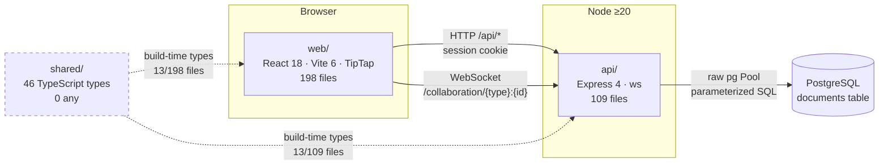

# Codebase Orientation — Ship

**Repo:** `US-Department-of-the-Treasury/ship` · **Commit:** `076a183` · **Oriented:** 2026-07-27 · **Written up:** 2026-07-28

Orientation was performed before any measurement (the audit's non-negotiable rule 1: diagnosis before treatment). This document is the write-up; the working notes live in `memory-bank/systemPatterns.md`. Where a claim came from a *later* audit measurement rather than the orientation pass, it is marked **[audit]** and carries a finding ID.

---

# Phase 1: First Contact

## 1. Repository Overview

### Getting it running — including what wasn't in the README

```bash
pnpm install
pnpm dev          # scripts/dev.sh: creates DB, migrates, seeds, picks free ports, starts api + web
```

Four things bit us that the README does not say:

1. **`pnpm dev` does not use port 3000 reliably.** `scripts/dev.sh` probes for a free port and writes the result to a repo-root `.ports` file. On this machine :3000 was held by an unrelated container, so the API came up on **:3001**. Read `.ports`; never assume.
2. **`pnpm db:migrate` silently under-applies.** It stops after migration 010 and still exits 0. Migrations 011–042 had to be applied individually before the database matched the schema the app expects. **[audit — DB-1, Critical]**
3. **`pnpm test` truncates whatever `DATABASE_URL` points at** — including your dev database, since `api/src/db/client.ts:10` reads the same `api/.env.local` that `dev.sh` writes. We had to build an isolated `ship_unit_audit` database before running the API suite. **[audit — TEST-9]**
4. **`pnpm test` only runs `@ship/api`.** Root `package.json:27` is `pnpm --filter @ship/api test`. Web's 16 unit-test files need `pnpm --filter @ship/web test` and are otherwise never executed. **[audit — TEST-1]**

### What `docs/` says, in our own words

`docs/` holds 19 files. The four that carry the architecture:

- **`unified-document-model.md`** — the core bet: every content type is a row in one `documents` table, distinguished by a `document_type` discriminator. The stated rationale is Notion's paradigm — *the difference between content types is properties, not structure*.
- **`application-architecture.md`** — tech-stack decisions and the deployment story. The recurring theme is **boring technology**: raw `pg` over an ORM, Express over a framework, server-authoritative sync.
- **`document-model-conventions.md`** — terminology, what earns a document vs. a config value, and the 4-panel editor layout (Icon Rail 48px → Contextual Sidebar 224px → Main Content → Properties Sidebar 256px).
- **`ship-philosophy.md`** — the constraints new code must satisfy. Effectively a written test for whether a change belongs.

The through-line: **the team optimized for one shape of thing**. One table, one editor component, one layout. That buys enormous consistency and makes the schema legible, and it pushes complexity into `properties` JSONB and into query patterns.

### The `shared/` package

`shared/src/types/` exports **46 types** across five modules — `api.ts`, `auth.ts`, `document.ts`, `user.ts`, `workspace.ts`. It is the cleanest code in the repo: 0 `any`, 5 assertions.

It is also barely used — **13 of 198** web files and **13 of 109** api files import it, while `web/src` re-declares the domain model ~40 times locally. **[audit — TS-5]** The root cause is upstream: API responses are themselves untyped (**TS-2**), so there was never an authoritative type to import.

### How the packages relate



`shared/` is dashed because it is a **build-time** dependency only — it emits types, not runtime code, and its adoption is thin enough that it does not currently function as a contract.

---

## 2. Data Model

### Schema

Defined in `api/src/db/schema.sql` (17 `CREATE TABLE`, 59 `CREATE INDEX`, one function, one trigger) plus **42 migration files** in `api/src/db/migrations/`. `schema_migrations` tracks what has been applied.

Critically, `schema.sql` carries the **end-state** schema and contains **zero `ALTER TABLE` and zero DML**. Migrations are the only mechanism that changes an already-existing database — which is what makes DB-1 dangerous rather than cosmetic. **[audit — DB-1]**

### The unified document model

One `documents` table serves docs, issues, projects, sprints, weeks, people, and more:

| Column | Role |
|---|---|
| `document_type` | discriminator — 10 values |
| `content` | JSONB — TipTap document JSON |
| `yjs_state` | BYTEA — CRDT binary state, the collaboration source of truth |
| `properties` | JSONB, **GIN-indexed** — everything type-specific (priority, assignee, state…) |
| `parent_id` | self-FK, guarded by a circular-parent trigger |
| `archived_at` / `deleted_at` | soft delete |

**How the discriminator is used in queries:** as a `WHERE` filter, and in partial indexes — e.g. `(workspace_id, document_type)` on active rows. It is *not* used to route to different tables or different code paths at the storage layer, which is the point of the design.

The cost of the design shows up in the `properties` JSONB: predicates like `properties->>'priority'` and `properties->>'assignee_id'` have **no expression statistics**, so the planner guesses. Combined with 13 indexes on `documents` to consider, planning ends up costing 3.1× execution. **[audit — DB-3]**

### Relationships

`document_associations` is a junction table with relationship types `parent`, `project`, `sprint`, `program`.

**A docs discrepancy worth recording:** `.claude/CLAUDE.md` states the legacy `program_id`/`project_id` columns still exist on `documents`. Migrations **027** and **029** drop them. The migrations are authoritative — but because of DB-1, whether they have actually run on a given database is a separate question from whether they exist in the repo. Verify with `\d documents` before relying on either.

### Indexes present vs. absent

Present on `documents`: `workspace_id`, `parent_id`, `document_type`, GIN(`properties`), visibility combos, partial archived/deleted, `(workspace_id, document_type)` active partial, conversion partials, a person `user_id` expression index.

**Absent:** `ticket_number`, `created_by`, `updated_at` — the first of which makes every issue permalink a sequential scan. **[audit — DB-7, DB-10]**

---

## 3. Request Flow

### Tracing one action: loading the issues list

```
web/src/pages/Issues.tsx
  → react-query (staleTime 5min, gcTime 24h, IndexedDB-persisted)
  → GET /api/issues
      → helmet                          app.ts:111
      → apiLimiter  (100 req/min/IP)    app.ts:137   ← [audit — API-1, Critical]
      → cors (credentials: true)        app.ts:138
      → express.json (10mb limit)       app.ts:142
      → cookieParser(sessionSecret)     app.ts:144
      → session                         app.ts:147
      → conditionalCsrf                 app.ts:186
      → requireAuth                     middleware/auth.ts
           · SELECT session JOIN users
           · SELECT role FROM workspace_memberships
           · UPDATE sessions SET last_activity   ← unconditional [audit — DB-2 / API-6]
      → routes/issues.ts
           · one parameterized SELECT over documents
           · one batched ANY($1) association lookup   (correctly batched — no N+1)
           · extractIssueFromRow(row: any)            ← [audit — TS-2]
  → JSON response (380 KB, uncompressed)              ← [audit — API-2, API-3]
```

### The middleware chain

Order from `api/src/app.ts`: trust-proxy (production only, `:94`) → helmet → **rate limiter** → CORS → body parsers → cookie parser → session → per-route `conditionalCsrf` → route-level auth.

Two things stand out. The rate limiter sits *before* auth, so it is keyed on IP rather than identity — which behind a shared NAT egress means a whole team shares one 100 req/min budget. **[audit — API-1]** And `conditionalCsrf` is applied per-route rather than globally, so whether a route is CSRF-protected is a property of its mount line, not of the middleware stack.

### Authentication

Session cookies, 15-minute inactivity timeout, 12-hour absolute. CSRF via `csrf-sync`: `GET /api/csrf-token` returns `{ token }` (**not** `csrfToken` — the field name cost us a debugging cycle), which must be echoed in the `x-csrf-token` header on mutations. Bearer-token requests skip CSRF entirely (`app.ts:52`).

**An unauthenticated request** gets a 401 from `requireAuth` before reaching any handler. Notably, `req.userId` and `req.workspaceId` are declared **optional** (`middleware/auth.ts:11-12`), so a route registered *without* `requireAuth` type-checks identically to one with it — 236 non-null assertions exist downstream to paper over this. **[audit — TS-4]**

The cookie is `sameSite: 'strict'` (`auth.ts:217`, `routes/auth.ts:188`), deliberately, for a government application. That decision constrains deployment topology: the frontend must be same-origin with the API, which is what the CloudFront distribution provides today.

---

# Phase 2: Deep Dive

## 4. Real-time Collaboration

### How the connection is established

The editor opens a Yjs `WebsocketProvider` against `/collaboration/{docType}:{docId}` (`web/src/components/Editor.tsx:367`). The URL is derived from `window.location.host` in production (`Editor.tsx:334`) — i.e. it assumes the collaboration endpoint is same-origin with the app.

Authentication happens **once, at the WebSocket upgrade** (`api/src/collaboration/index.ts:659`) and is never re-checked per message. **[audit — ERR-2, Critical]** A session revoked after connection keeps writing.

### How Yjs syncs state

Standard Yjs sync protocol over the socket; edits are CRDT updates, not diffs. On load, `getOrCreateDoc` reads `yjs_state` (BYTEA) and falls back to converting the `content` JSON if no CRDT state exists yet.

### Two users editing simultaneously

The CRDT merges without a lock or a last-write-wins resolution — this is the entire justification for the Yjs architecture. We verified it holds: two clients typing concurrently both land their characters in the database (`probe4-concurrency.json`). The two browser contexts had not converged to an identical *view* within the sample window, which is expected mid-convergence rather than data loss.

**Nothing in the test suite verifies this.** `browser.newContext()` appears in 2 of 71 spec files, neither for editing; the one two-client test uses sequential `newPage()` with fixed sleeps. **[audit — TEST-4]**

### How the server persists Yjs state

`persistDocument()` (`collaboration/index.ts:118`) calls `yjsToJson(fragment)` and writes the result to `documents.content`, alongside the binary `yjs_state`. That converter — `api/src/utils/yjsConverter.ts` — is **fully untyped**: 12 `any` in 245 lines, every exported signature included. It is the only code translating collaborative state into the durable content column. **[audit — TS-3]**

An undecodable `yjs_state` produced an **uncaught** lib0 crash (`Error: Unexpected end of array`) that terminated the server process in our probe log. Mechanism not fully pinned; flagged for clean repro.

---

## 5. TypeScript Patterns

**Version:** TypeScript `^5.7.2`, consistent across all three packages.

### tsconfig settings — and the gap

Root `tsconfig.json` sets `strict`, `noUncheckedIndexedAccess`, `noImplicitReturns`, `noFallthroughCasesInSwitch`. `api/tsconfig.json:2` and `shared/tsconfig.json:2` both `extends` it.

**`web/tsconfig.json` has no `extends` key.** It re-declares `strict: true` standalone and therefore runs without the other three. `pnpm type-check` is green; restoring the three flags surfaces **102 errors**, 94 of them the "possibly undefined" class. The repo's own reference config at `research/configs/web/tsconfig.json` *does* extend root — so this is drift, not intent. **[audit — TS-1]**

### How types are shared

Via `@ship/shared` — in principle. In practice 13 of 198 web files import it (see §1).

### Feature examples found in the codebase

- **Utility types** — `Partial<ProjectProperties>` (`shared/src/types/document.ts:320`), `Record<string, …>` in `api.ts:11`, `workspace.ts:42`, `document.ts:241,247`.
- **Generics** — `shared/src/types/api.ts:2` exports `ApiResponse<T = unknown>` with a proper `ApiError`. Correctly written, then bypassed: `web/src/lib/api.ts:5` re-declares its own `ApiResponse<T>`.
- **Discriminated unions** — the `document_type` field is a discriminated union *in spirit* (one shape, a literal tag), but it is not modelled as a TypeScript discriminated union over `properties`. Each document type's properties are a separate interface, and nothing at the type level ties `document_type: 'issue'` to `IssueProperties`. This is the single largest missed opportunity we found in the type system.
- **Type guards** — essentially absent from the production data path. The DB→HTTP boundary is seven `(row: any)` mapper functions instead. **[audit — TS-2]**

### Patterns we did not recognize, and researched

- **`csrf-sync`** — a synchroniser-token CSRF strategy rather than the double-submit-cookie pattern we expected. The token lives in the session and is echoed via header.
- **`lib0`** — Yjs's low-level encoding/decoding library. It surfaces in the stack only when something goes wrong, which is how we found the decode crash.
- **`import.meta.glob`** in `web/src/components/icons/uswds/Icon.tsx:23-26` — Vite's directory-glob import. Elegant for "any icon name just works," but it defeats tree-shaking: 245 icon chunks are emitted and **209 are never referenced**. **[audit — BUN-5]**

---

## 6. Testing Infrastructure

### Structure

**71 Playwright spec files, 869 tests** (`playwright test --list`; the config comment still advertises `[1/641]`). Plus 28 API vitest files and 16 web vitest files.

### Fixtures and database lifecycle

- **E2E:** per-worker PostgreSQL **testcontainers** with `vite preview` (the dev server is documented as blowing up memory). Seed data comes from `e2e/fixtures/isolated-env.ts` — the repo's rule is that a test needing N rows should have fixtures create N+2, and that missing data should produce an assertion with an actionable message rather than a `test.skip()`.
- **API unit:** *no* isolation. `api/src/test/setup.ts:14-20` runs a 15-table `TRUNCATE … CASCADE` in the `beforeAll` of every one of the 28 files, against whatever `DATABASE_URL` points at. `fileParallelism: false` is the workaround for the resulting interference. **[audit — TEST-9]**

### Runtime and results

~9 minutes at `PLAYWRIGHT_WORKERS=4`. Worker auto-sizing derives from `os.freemem()`, which on macOS collapses to **1 worker** (~4× slower) — every measurement in this audit pins the worker count. **[audit — TEST-10]**

**Do all tests pass?** Nominally yes; meaningfully no:
- 13 web unit tests fail and nothing in the repo runs them. **[TEST-1]**
- 68 e2e tests can pass with zero assertions executed, including the only stored-XSS and audit-log-authz checks. **[TEST-2]**
- Across 3 identical runs, 11 tests flaked; retries erased 7/5/2 first-attempt failures. One test failed on first attempt in **100%** of runs and was reported as passing every time. **[TEST-3]**

---

## 7. Build and Deploy

### Dockerfile

Single stage, `FROM public.ecr.aws/docker/library/node:20-slim`. The line that matters:

```dockerfile
CMD ["sh", "-c", "node dist/db/migrate.js && node dist/index.js"]
```

**Migrations run on every container start**, and `&&` proceeds whenever migrate exits 0 — which, per DB-1, it does even while skipping 32 of 42 files. Any environment not already at the end-state schema starts a server against a partially-migrated database, having printed success.

### docker-compose

`docker-compose.yml` declares `postgres` only. `docker-compose.local.yml` adds `api` and `web` for a full local stack.

### Terraform

`terraform/` is **AWS**, not the Render setup the brief assumes: Elastic Beanstalk + Aurora Serverless v2 + VPC + CloudFront/S3 + WAF + SSM. 74 resource blocks in the flat root.

- Providers `hashicorp/aws ~> 5.0` and `hashicorp/random ~> 3.6` are **unpinned in the flat root** (no committed `.terraform.lock.hcl`). The modular `environments/*` paths *are* locked. **[audit — TF-4]**
- **Two divergent root configs** manage the same infrastructure and have already drifted — the flat root has WAF and realtime logging; the modular path does not. **[audit — TF-2]**
- The pinned Terraform `1.6.0` can no longer `init` (expired provider-signing key). **[audit — TF-3]**
- Only the Terraform *state* bucket has destroy protection; the production Aurora cluster and the uploads bucket have none. **[audit — TF-1]**

### CI/CD

**There is none.** `.github/` contains only `instructions/` — no `workflows/`. No `.gitlab-ci.yml`, `Jenkinsfile`, or `buildspec.yml` anywhere in the tree. `.husky/pre-commit` runs `check-empty-tests.sh`, `check-api-coverage.sh` and `comply opensource` — **it never executes a test suite**.

This is the single fact that best explains the audit's findings. Every drift we found — the web tsconfig, the failing web tests, the stale test assertions after the sprint→week rename — is the kind of thing a CI run catches on the commit that introduces it.

---

# Phase 3: Synthesis

## 8. Architecture Assessment

### The 3 strongest decisions

1. **The unified document model.** One table with a `document_type` discriminator and JSONB properties. Adding a content type is a migration and a properties interface, not a new table, new CRUD layer, and new editor. The schema stays legible at 500 documents and would at 500,000. It is a real bet with real costs, made deliberately and documented.
2. **Yjs CRDTs for collaboration, with the server authoritative.** Concurrent edits merge without locking or last-write-wins, and we verified it holds under a genuine two-client test. Choosing a CRDT rather than hand-rolling operational transforms is the kind of decision that looks expensive up front and saves years.
3. **Boring technology, held consistently.** Raw `pg` with parameterized SQL instead of an ORM; Express instead of a framework; one shared `Editor` component instead of per-type editors. The codebase is *readable*. We oriented in a day on a system we had never seen, which is the actual test.

Worth adding: the security posture is better than average. Encryption at rest, private subnets, WAF, SSM SecureString, no exploitable XSS via any vector we tried, and clean zod input validation with real 400s.

### The 3 weakest points

1. **No CI, and therefore no regression gate at all.** 13 failing tests nobody runs, 68 assertion-less e2e tests, a `pnpm lint` that matches nothing and exits 0. Everything else on this list is downstream of this one.
2. **The database-to-HTTP boundary is untyped.** 707 `pool.query` calls, zero supplying the generic; seven `(row: any)` mappers standing between SQL and the JSON contract the frontend consumes. A column rename produces `undefined` in a live response with no compile-time signal anywhere.
3. **Silent failure as a recurring pattern.** `db:migrate` reports success while skipping 32 files. The sync indicator reads "Saved" over edits that were never persisted. Rejected writes are dropped with only a transient toast. Each is a separate bug; together they are a habit — errors get swallowed to keep the happy path smooth.

**Where we would focus:** CI first, because it defends everything else. Then the collaboration server, because both data-loss Criticals live in one file and share one fix.

### What we would tell a new engineer first

> Everything is a row in `documents`. Start at `api/src/db/schema.sql`, then read `docs/unified-document-model.md`.
>
> Then four things that will cost you a day each if nobody tells you: `pnpm db:migrate` under-applies and exits 0, so verify `schema_migrations` has 42 rows. `pnpm test` will truncate whatever database `DATABASE_URL` points at — never run it against your dev DB. Root `pnpm test` skips the entire web package. And the dev server picks its own ports, so read `.ports`.
>
> The house rules in `.claude/CLAUDE.md` are real constraints, not suggestions — no new content tables, reuse the shared `Editor`, schema changes go in numbered migrations only.

### What would break first at 10× users

**The rate limiter, immediately and artificially.** At 100 req/min per IP with 4–16 requests per page view, and a shared NAT egress collapsing a whole team into one key, users hit the ceiling at roughly 6–10 navigations per minute *today*. Nothing else can be observed until it is raised.

Behind it, in order:

1. **Session-table write contention.** Every authenticated request — including every read — does `UPDATE sessions SET last_activity`. At 10× that is 10× the WAL and 10× the row-lock pressure on a single row per user, against a pool capped at 20 connections.
2. **Unpaginated list endpoints.** `/api/issues` is 380 KB at 254 issues with no `LIMIT`; the command palette re-downloads the entire 294 KB corpus on every open. Both grow linearly — ~3.8 MB and ~2.9 MB respectively at 10× volume.
3. **Query planning.** 61% of database time is already planning rather than execution, because every statement is sent unnamed and re-planned. That fraction gets worse as the `documents` table grows and its 13 indexes take longer to consider.

Notably, the *unified document model itself* is not on this list. The scaling problems are all in the access layer — limits, indexes, prepared statements, pagination — and every one of them is fixable without touching the data model. That is a good sign about the original architecture.
