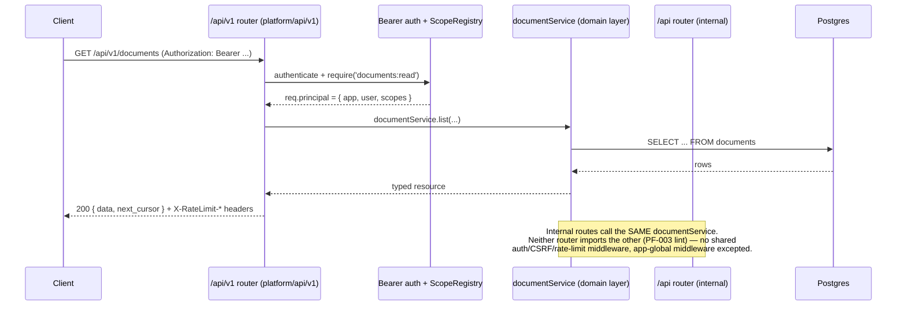

# Ship Platform Architecture

**Status:** Day-1 skeleton (PF-903 / TRO-424). Living document — updated as each Week 6 epic
(E0–E9, see `PLUGFORGE.MD`) lands; final accuracy pass near submission. Sections below describe
**decided design** (`PLUGFORGE.MD` §2 + the PM triage decisions recorded across the project's
tickets), not yet-observed runtime behavior for the new platform surface specifically — as of this
writing no platform code has landed (verified: no `api/src/platform/`, `sdk/`, or `integrations/`
directories exist in this worktree). **Scope of that caveat:** it applies to paths under
`api/src/platform/`, `sdk/`, and `integrations/` — those are planned locations, refreshed against
the real code once the owning ticket lands. It does **not** apply to citations of code that already
exists and ships today — `api/src/app.ts`, `agent/src/shipClient.ts:337`,
`api/src/collaboration/index.ts:207` — which are observed (read directly, 2026-08-10) and describe
current behavior this platform work builds on top of, not a future state.

**Scope:** PlugForge (Week 6) — Ship's public platform layer: `/api/v1`, OAuth 2.0, signed
webhooks, `@ship/sdk`, and the FleetGraph agent rewired as a platform citizen. `PLUGFORGE.MD` is
the source of record for the full PRD; this document covers only the brief's mandated
architecture sections. Where the two disagree, `PLUGFORGE.MD` wins — file a doc-fix ticket rather
than trusting this file over it.

---

## Module Layout

New code lands under three roots (`PLUGFORGE.MD` §2.1), one sentence per module:

```text
api/src/platform/           # NEW — the platform layer
  oauth/                    #   OAuth 2.0 flows, endpoints, PKCE, token issuance/rotation
  scopes/                   #   ScopeRegistry — scopes registered as data, not switch statements
  ratelimit/                #   Per-app/per-token token buckets + response-header middleware
  webhooks/                 #   Event registry, IEventBus, HMAC signer, deliverer, DLQ, replay
  audit/                    #   Public API audit trail (writes public_api_audit rows)
  api/v1/                   #   The public router: resources, ApiError shape, cursor pagination
  openapi/                  #   v1 OpenAPI 3.1 registry + in-process spec generator
sdk/                        # NEW — @ship/sdk workspace package; the only sanctioned way integrations/* reach Ship
integrations/               # NEW — cli/, browser-demo/, slack/ — depend on @ship/sdk only, never api/src
```

Existing modules (`api/src/routes/**`, `api/src/middleware/**`, `web/`, `agent/`) keep their
current shape. `api/src/platform/api/v1/**` calls the same domain services the internal routes
call — it must never import `api/src/routes/**` directly (enforced by lint, PF-003).

---

## SOLID Rationale

| Component | File path (planned) | Principle | Why |
|---|---|---|---|
| `ScopeRegistry` | `api/src/platform/scopes/` | **OCP** (Open/Closed) | New scopes register themselves at module load (§2.3); the enforcement path (`require(scope)` middleware) is never edited to add one — open for extension via registration, closed for modification of the check itself. |
| `IEventBus` | `api/src/platform/webhooks/` | **DIP** (Dependency Inversion) | The domain write path depends on the `IEventBus` / `IWebhookDeliverer` interfaces, not a concrete queue. The must-ship in-process/in-memory implementation is a Liskov-substitutable drop-in for a future queue-backed one — high-level policy ("publish on write") doesn't depend on low-level delivery detail. |
| SDK resource clients (`DocumentsClient`, `IssuesClient`, `SprintsClient`, `WebhooksClient`) | `sdk/src/` | **ISP** (Interface Segregation) | `@ship/sdk`'s `ShipClient` exposes one narrow client per resource instead of one god-object with every method — a CLI consuming only `documents` never depends on `webhooks`' surface. |

---

## Composition Root

`api/src/app.ts` remains the single wiring point (§2.1). It constructs every platform dependency
concretely and injects it — nothing below reaches into a singleton.

```ts
// api/src/app.ts — composition root (pseudo-code; PF-001 fills in the real wiring)
const scopeRegistry = new ScopeRegistry()                          // registers scopes at import time
const rateLimiter    = new TokenBucketRateLimiter({ perApp: 120, perToken: 60 })
const eventBus       = new InProcessEventBus()                     // IEventBus
const deliverer      = new InMemoryWebhookDeliverer(pool, systemClock) // IWebhookDeliverer, persists every attempt
const oauthStore     = new PostgresOAuthStore(pool)

const apiV1Router = createApiV1Router({ scopeRegistry, rateLimiter, eventBus, oauthStore, deliverer })
app.use('/api/v1', apiV1Router)
```

**In-memory test-wiring sibling** — tests construct the same dependency graph with in-memory
doubles, so unit tests never touch Postgres or a real timer:

```ts
// api/src/platform/**/__tests__ wiring — in-memory sibling of the composition root above
const scopeRegistry = new ScopeRegistry()                          // same as composition root — no I/O, no double needed
const rateLimiter    = new TokenBucketRateLimiter({ perApp: 120, perToken: 60 }) // same as composition root — no I/O, no double needed
const eventBus       = new InProcessEventBus()                     // already in-memory — no double needed
const deliverer      = new InMemoryWebhookDeliverer(new FakePool(), new FakeClock()) // in-memory pool double + deterministic clock (§2.6)
const oauthStore     = new InMemoryOAuthStore()                    // test double
const router = createApiV1Router({ scopeRegistry, rateLimiter, eventBus, oauthStore, deliverer })
```

Same pattern FleetGraph's own tests already use for `ItemStore` (`agent/`): construct the real
composition-root shape, swap only the I/O-bound piece.

---

## Public/Internal Boundary — Sequence Diagram

Skeleton fidelity — refine once PF-001/PF-107 land.



---

## OAuth Flow Diagrams

Skeleton fidelity — refine as E1 (PF-100–PF-107) lands. Three grants ship, hand-rolled and
IETF-minimal (RFC 6749 + 7636 + 8628 — no implicit grant, no plain-method PKCE, S256 only): two
user-facing grants + `client_credentials` for first-party apps. `PLUGFORGE.MD`'s "two grants"
phrasing refers to the two user-facing ones diagrammed below (Authorization Code + PKCE, Device
Authorization); `client_credentials` is a third, architect-added grant (PF-104) for first-party
apps only — its sole consumer is the FleetGraph agent (`ship_app_fleetgraph`, see Agent as Platform
Citizen, below), so no separate flow diagram: RFC 6749 §4.4 is a single token-endpoint POST with no
redirect or polling steps to sequence.

### Authorization Code + PKCE (rotation points marked)

```mermaid
sequenceDiagram
    participant App as Client app
    participant Browser
    participant Ship as /oauth/authorize, /oauth/token

    App->>App: generate code_verifier; code_challenge = S256(code_verifier)
    App->>Browser: redirect to /oauth/authorize?code_challenge=...&method=S256
    Browser->>Ship: session-authed consent screen
    Ship-->>Browser: redirect with single-use code (10 min TTL)
    Browser-->>App: code
    App->>Ship: POST /oauth/token { code, code_verifier }
    Ship->>Ship: verify code_verifier against stored code_challenge (S256)
    Ship-->>App: access_token (1h) + refresh_token (30d, one-time-use)

    Note right of Ship: ROTATION POINT 1 — refresh: each use issues a child<br/>token in the same family_id and consumes the parent.
    App->>Ship: POST /oauth/token { grant_type: refresh_token }
    Ship-->>App: new access_token + rotated refresh_token

    Note right of Ship: ROTATION POINT 2 — reuse of an already-rotated refresh<br/>token revokes the ENTIRE family_id (stolen-token detection).
```

### Device Authorization Grant

```text
ship login  --->  POST /oauth/device/code
                     <--- { device_code, user_code: "BDWJ-KXQT", verify_url, interval }
CLI prints user_code + verify_url, polls POST /oauth/token { device_code }

User      --->  visits verify_url, enters user_code, approves (session-authed)

CLI poll  <---  authorization_pending  -->  (slow_down: interval++)  -->  access_token
```

---

## Webhook Pipeline

```text
domain write (documentService) -> IEventBus.publish -> subscription matcher
  -> HMAC signer -> IWebhookDeliverer (retry scheduler) -> delivery log -> DLQ -> replay
```

- **Signature origin:** computed by the HMAC signer (`api/src/platform/webhooks/`) at delivery
  time, over `${t}.${rawBody}` using the subscription's decrypted signing secret (decrypted only
  to compute the HMAC key, never for display) — header
  `Ship-Signature: t=<unix-seconds>,v1=<hex-hmac-sha256>`, attached immediately before the
  outbound POST. Subscribers call the SDK's `verifyWebhook()` (default 300s tolerance,
  constant-time compare).
- **Idempotency-Key origin:** the *original* delivery's identifier. A first-attempt delivery
  generates one; `POST /api/v1/webhooks/deliveries/:id/replay` reuses that **same** key on the
  replayed delivery, so a subscriber's own dedupe logic treats a replay as "already seen," not as
  a new event (PF-306).
- Retry schedule: 1s, 4s, 16s, 1m, 5m, 30m with jitter. 5xx/timeout retries; 4xx dead-letters
  immediately; 6 failed attempts → DLQ. Tested with an **injected deterministic clock** — never a
  real `setTimeout` wait (§2.6).

---

## SDK Surface

`@ship/sdk` (`sdk/`), zero runtime dependencies, native `fetch`:

```ts
class ShipClient {
  readonly documents: DocumentsClient;
  readonly issues:    IssuesClient;
  readonly sprints:   SprintsClient;
  readonly webhooks:  WebhooksClient;
  constructor(opts: { token?: string; baseUrl?: string; tokenStore?: ITokenStore });
  me(): Promise<Me>;
  static authorizationCodeFlow(opts): Promise<ShipClient>;   // browser PKCE, no secret
  static deviceLogin(opts): Promise<ShipClient>;
}
function verifyWebhook(headers, rawBody, secret, toleranceSec = 300): boolean; // < 1 ms
```

**Stable vs. pre-1.0** — this is this project's own API-shape commitment, not semver of a
published package (`sdk/` stays a workspace package; npm-publishing is explicitly out of scope,
§8):

| Surface | Mark | Why |
|---|---|---|
| `ShipClient` constructor, `me()`, `documents` / `issues` / `sprints` resource clients, `verifyWebhook`, async-iterator pagination (`iterate()`) | **stable** | Directly mirrors the OpenAPI spec; PF-405's parity fitness test keeps it that way. Shape is fixed by the resources in §2.4 and shouldn't change without a spec change. |
| `webhooks` resource client (subscriptions / deliveries / replay CRUD) | **stable** once PF-401 lands | Same parity guarantee as above — called out separately only because it ships slightly later (E4). |
| `deviceLogin()` / `authorizationCodeFlow()` auth helpers, `ITokenStore` (`MemoryTokenStore` / `FileTokenStore`) | **pre-1.0** | Hand-written against the OAuth flows, not generated from the spec — §2.8 names this openly as a trade-off (type quality over generated drift-safety). Signatures may still move during E4/E6 build-out (CLI, browser demo) before they're proven against real integrations. |

---

## Agent as Platform Citizen — Before / After

**Before (Week 5, shipped):** FleetGraph (`agent/`) reads Ship's internal REST API directly via
its own `ShipClient` (`agent/src/shipClient.ts:337`, 10 read methods) and writes through
`GateShipClient` (`:569`, 3 writes) using the acting human's token, passed explicitly per call. No
OAuth, no scopes, no public audit trail — the agent is a privileged insider talking to internal
routes with a hand-rolled client.

**After (Epic 7, PF-700–PF-704):** the agent authenticates as a first-party OAuth app
(`ship_app_fleetgraph`, Client Credentials grant, read-only scopes `documents:read, issues:read,
sprints:read`) for its 10 reads, and as the acting human (a short-lived scoped personal token —
PF-107's second token class) for its 3 gated writes. **Both paths go through `@ship/sdk`** — the
same package any third-party integration uses — gated behind `AGENT_PLATFORM_MODE=sdk|internal`
(default stays `internal` until PF-704's flag matrix is green). The write-boundary invariant is
unchanged: `graph.ts` still structurally cannot write (`graphWriteBoundary.test.ts` still proves
it), only `gate.ts` can, and it still holds no token of its own — before and after, only the
transport underneath the gate's writes changes.

**Audit-log payoff:** every agent action — the 10 reads under `ship_app_fleetgraph`'s `client_id`,
each of the 3 writes under the acting human's `user_id` — now lands a row in `public_api_audit`
(request_id, client_id, user_id, route, scope used, status, latency). Epic 7's submission proof
(PF-704) is literally querying that audit trail for the agent's `client_id` and showing every
action it took — a fact that was structurally unobservable before this rewire, because internal
routes carry no such trail.

---

## Failure Modes

**Corrupted token store.** `oauth_tokens` / `oauth_apps` hold hashes, not raw tokens
(`access_token_hash`, `client_secret_hash`) — a corrupted or truncated hash column fails closed:
the incoming bearer token's hash won't match any row, so the request gets an ordinary
`401 unauthorized` (`details.reason: invalid`), not a crash or an auth bypass. The dangerous case
is corruption of the `family_id` / `parent_id` chain that refresh-rotation reuse-detection depends
on — a broken family graph could fail to revoke a stolen token's family correctly. Mitigation:
rotation/family-invalidation logic is unit-tested directly against the schema (PF-105); a
corrupted store is a data-integrity incident to catch via routine `\d`-style verification (per this
repo's DB-1 precedent), not something the request path is expected to self-heal.

**Mid-flight secret rotation.** A webhook signing secret (`whsec_...`) is shown once and stored
encrypted (see Documented Deviations, below) — rotating it invalidates the old secret immediately
(the same no-grace-period choice as OAuth app-secret rotation, PF-102). A delivery already queued
or mid-retry at rotation time was signed correctly under the secret valid at send time; the
failure mode is a subscriber-side race between "receive delivery" and "pick up the new secret from
the portal," not a signing defect on Ship's side. Documented here as an explicit gap: no
dual-secret verification window ships in Week 6.

**Deliverer crash.** The webhook deliverer is an in-memory queue on a single Render instance
(§2.6 — same justified precedent as FleetGraph's `ItemStore`), so a process crash loses whatever
existed only in memory. What survives: every attempt already made is persisted to
`webhook_deliveries` before the deliverer moves on, so the delivery log, DLQ, and replay are
durable. What's lost on crash: an attempt that was scheduled (`next_attempt_at` computed) but not
yet persisted, and any in-flight HTTP call whose response never got recorded. Intended recovery: a
boot-time scan for `pending` / `failed` rows whose `next_attempt_at` has passed, re-enqueued into
the fresh in-memory queue — this is design intent for PF-304, not yet implemented; state plainly
whether it shipped once PF-304 lands.

**OpenAPI generator boot-throw.** The v1 spec (`/api/v1/openapi.json`) is generated in-process
from route metadata at boot (PF-202), not committed-then-served — if a route's Zod schema fails to
compose into valid OpenAPI (a circular `z.lazy()` reference, or a route registered without the
scope/response metadata PF-203's fitness walk expects), the generator throws during `app.ts`'s
composition-root construction. Decision: this should fail the boot, not silently serve a stale or
partial spec — an API whose spec can't be trusted is worse than an API that won't start, and
PF-203's fitness test is the CI-time backstop meant to catch a malformed route before it ever
reaches a running boot. Not yet decided: whether a future iteration should instead log-and-exclude
just the offending route while still failing CI, if one bad route blocking all of `/api/v1` proves
too disruptive in practice — revisit if PF-202/PF-203 hit this for real.

---

## Documented Deviations

**Signing secret: encrypted, not hashed (§2.2 note).** The brief says "hashed signing secret." A
one-way hash is unimplementable for this purpose: the server must recover the plaintext secret at
delivery time to compute the HMAC signature, and a hash cannot be reversed by design. Decision:
generate `whsec_...` secrets, return the plaintext exactly once (creation/rotation), and store it
**encrypted** at rest (AES-256-GCM, key from `SECRET_ENCRYPTION_KEY`) rather than hashed — the same
pattern Stripe uses for webhook signing secrets. This is a deliberate, defensible deviation from
the brief's literal wording, not an oversight, and a likely interview question.

**Collab-persist events excluded from webhook publication (PF-301).** The Yjs collaboration
server's autosave (`api/src/collaboration/index.ts:207`) does a debounced
`UPDATE documents SET yjs_state, content, properties ...` on every live editing session — a tenth
document-write site alongside the nine route files that do inline writes today. Decision:
`document.updated` fires only from explicit API writes routed through `documentService` (the four
resource routers), never from the collaboration autosave path. The alternative — a webhook per
keystroke-batch debounce — would mean a subscriber gets an event every few seconds per open editor,
which is not what "a document changed" means to an integration. This is a documented, defended
exclusion, not an accident: any write that bypasses `documentService` fires no webhook, and
enumerating exactly which sites route through it versus which are excluded is PF-301's own AC.

---

## Cross-References

- **IAM adaptation memo** (Render vs. AWS least-privilege mapping) — **PF-902**, at
  `docs/IAM-ADAPTATION-RENDER.md`. *(Derived, not independently verified from this worktree: as of
  this writing PF-902 has landed on branch `docs/pf-902-iam-memo`, not yet merged to `main` — the
  path is a cross-ticket fact, not a file read directly. Confirm the path once that branch merges.)*
- **Per-epic before/after write-ups and the three discovery drafts** — **PF-906**.
- `PLUGFORGE.MD` §2 is the source of record for the data model, scopes list, error contract, and
  rate-limit defaults; this document restates only what the brief's mandated sections require.

---

*Last updated: 2026-08-10 (PF-903 Day-1 skeleton, TRO-424). No platform code has landed as of this
writing — citations under `api/src/platform/`, `sdk/`, and `integrations/` are planned locations,
not observed ones; citations to existing code (`api/src/app.ts`, `agent/src/shipClient.ts`,
`api/src/collaboration/index.ts`) were read directly and are observed. Refresh each section against
the real code as its owning ticket (named inline) lands.*
